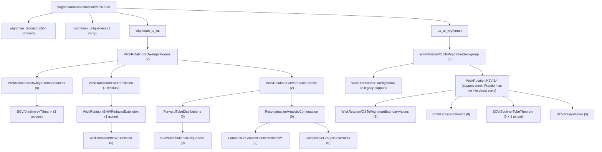

# OSReconstruction

A Lean 4 formalization of the **Osterwalder-Schrader reconstruction theorem** and supporting infrastructure in **von Neumann algebra theory**, built on [Mathlib](https://github.com/leanprover-community/mathlib4).

## Current Axiom Inventory

The tracked production tree currently contains **14 explicit axioms** (verified by `rg '^axiom\s+\w' OSReconstruction --glob '*.lean'`):

**Functional analysis (2):**
- `schwartz_nuclear_extension` in `Wightman/WightmanAxioms.lean` — **partially proved**: nuclearity of Schwartz space is now proved in the [`gaussian-field`](https://github.com/or-n/gaussian-field) library; the remaining gap is importing the instance and deriving the kernel theorem
- `exists_continuousMultilinear_ofSeparatelyContinuous` in `Wightman/WightmanAxioms.lean` — **proved** in [`gaussian-field`](https://github.com/mrdouglasny/gaussian-field) (`GeneralResults/SeparatelyContMultilinear.lean`, extension branch); remaining gap is importing the theorem

**SCV / tube domain (8):**
- `bv_implies_fourier_support` in `SCV/VladimirovTillmann.lean` — growth + BV → spectral support in dual cone (Vladimirov 25.1)
- `fl_representation_from_bv` in `SCV/VladimirovTillmann.lean` — Fourier-Laplace representation from BV + spectral support (Vladimirov 25.5)
- `schwartz_clm_fubini_exchange` in `GeneralResults/SchwartzFubini.lean` — CLM-integral exchange for Schwartz-valued families (Fréchet Bochner)
- `distributional_cluster_lifts_to_tube` in `SCV/VladimirovTillmann.lean` — distributional cluster on tube boundary lifts to pointwise cluster on tube interior
- `tube_boundaryValueData_of_polyGrowth` in `SCV/TubeBoundaryValues.lean` — BV existence from global polynomial growth
- `tube_boundaryValue_of_vladimirov_growth` in `SCV/TubeBoundaryValueExistence.lean` — BV existence from Vladimirov growth (M>0)
- `tube_boundaryValue_realizes_dualCone_distribution` in `SCV/FourierSupportCone.lean` — BV realized by dual-cone distribution
- `bochner_tube_extension` in `SCV/BochnerTubeTheorem.lean` — global Bochner tube extension theorem

**SNAG / spectral (1):**
- `snag_theorem` in `GeneralResults/SNAGTheorem.lean` — Stone-Naimark-Ambrose-Godement: every strongly-continuous unitary representation of a locally compact abelian group has a joint projection-valued spectral measure (Reed-Simon I VIII.12 / Mackey 1957). Vetted "Standard"; see `docs/cluster_axiom_vetting.md` entry 1.

**Reconstruction bridge (1):**
- `reduced_bargmann_hall_wightman_of_input` in `Wightman/Reconstruction/WickRotation/BHWReducedExtension.lean`

**Wightman GNS spectral (2):**
- `gns_l2_spectral_data_axiom` in `Wightman/Spectral/Ruelle/L2_NoZeroMomentumAtom.lean` — for any pair of states orthogonal to the vacuum in the GNS Hilbert space, the spacetime translation rep has a finite Borel spectral measure with AC spatial marginal and SNAG-derived Fourier-bridge identity. References: Glimm-Jaffe §6.2 (mass-hyperboloid spectral analysis), Reed-Simon II §IX.8 (SNAG / AC spectral measures), Streater-Wightman §3.5. Adopted as a single axiom at the GNS-spectral boundary; vetting status: see `docs/cluster_axiom_vetting.md`.
- `wightman_l4_spectral_data_axiom` in `Wightman/Spectral/Ruelle/L4_UniformPolynomialBound.lean` — for any Wightman family and any arities `(n, m)`, the joint analytic continuation `W_analytic_BHW (n+m)` admits a polarized Fourier representation along real spatial shifts with polynomial-and-boundary-regulated mass bound `C(1+‖z₁‖+‖z₂‖)^N · (1+(tubeBoundaryDist z₁)⁻¹)^M · (1+(tubeBoundaryDist z₂)⁻¹)^M` (Streater-Wightman Theorem 3.1.1 shape). References: Streater-Wightman 3.1.1 / §3.5, Bogoliubov-Logunov-Todorov §11, Glimm-Jaffe §6.2, Reed-Simon II §IX.8. Discharges the `bound` field of `RuelleAnalyticClusterHypotheses` unconditionally. Vetting status: see `docs/cluster_axiom_vetting.md` (entry 11).

### Conditional theorems and inventoried frontier lemmas

The R→E cluster route (`W_analytic_cluster_integral`,
`wickRotatedBoundaryPairing_cluster`, `schwinger_E4_cluster_OPTR_case`
in `Wightman/Reconstruction/WickRotation/RuelleClusterBound.lean`)
is a **conditional theorem**: it takes an explicit
`RuelleAnalyticClusterHypotheses Wfn n m` parameter packaging the two
textbook Ruelle 1962 / Araki-Hepp-Ruelle 1962 inputs (uniform polynomial
bound + pointwise factorization on PET). The `bound` field is now
unconditionally satisfied via `wightman_l4_spectral_data_axiom`; the
`pointwise` field still requires call-site supply.

**Active sorry (2026-05-08)**: the dominator-integrability step in
`W_analytic_cluster_integral_via_ruelle` (`RuelleClusterBound.lean:718`).
The bound shape was repaired (regulator added) after a vacuity finding;
the cluster proof's existing dominator no longer matches the new shape
and requires IBP rework (Streater-Wightman §3.4 / Ruelle 1962). See
`docs/ruelle_bound_vacuity_concern.md`.

L5 (`OSReconstruction/Wightman/Spectral/Ruelle/L5_SpectralRiemannLebesgue.lean`)
— pure measure-theoretic Riemann-Lebesgue for finite measures with AC
spatial marginal — is now **fully proved** (`#print axioms
spectral_riemann_lebesgue` shows only `[propext, Classical.choice,
Quot.sound]`, no sorryAx, no project axioms beyond Mathlib).

The Path A blueprint and L2 (no zero-momentum atom) reductions are
parked in `Proofideas/` as architectural reference, not in production.

The former `vladimirov_tillmann` axiom has been **proved as a theorem** from 3 of the SCV axioms above plus ~10K lines of Paley-Wiener-Schwartz proofs. See `docs/vladimirov_tillmann_summary.md` for details.

Two former axioms — `semigroupGroup_bochner` and `laplaceFourier_measure_unique`
(BCR Theorem 4.1.13) — have been **eliminated** by importing proved theorems from
[`mrdouglasny/hille-yosida`](https://github.com/mrdouglasny/hille-yosida) (0 sorrys, 0 custom axioms).

## Overview

This project formalizes the mathematical bridge between Euclidean and relativistic quantum field theory. The OS reconstruction theorem establishes that Schwinger functions (Euclidean correlators) satisfying certain axioms can be analytically continued to yield Wightman functions defining a relativistic QFT, and vice versa.

In the current formalization, the theorem surfaces are the corrected ones:
- `R -> E` lands on the honest zero-diagonal Euclidean Schwinger side, not an a priori full-Schwartz Euclidean extension.
- `E -> R` uses the corrected OS-II input, namely the OS axioms together with the explicit linear-growth condition.

### Route Discipline

For OS-critical work, this repo follows the Osterwalder-Schrader reconstruction
route itself as closely as possible:
- zero-diagonal Euclidean test spaces are the honest Euclidean surface;
- the preferred `E -> R` path is the OS semigroup / Hilbert-space /
  analytic-continuation route;
- for `E -> R`, theorem shape should follow OS II Sections IV-VI: start from
  OS semigroup / Hilbert-space matrix elements, continue holomorphically, and
  recover Wightman data as Lorentzian boundary values of that common
  holomorphic object;
- stronger standalone Euclidean kernel-representation statements may be studied
  in `test/` or `Proofideas/`, but they are not to replace the OS route in
  production unless explicitly approved;
- convenience shortcuts that change category are also out of bounds in
  production: if OS stays in Hilbert-space, scalar matrix-element, or
  distributional language, we stay there too unless explicitly approved
  otherwise;
- same-test-function cross-domain equalities are banned by default in
  production. In particular, no theorem of the form `W_n(f) = S_n(f)` may be
  introduced unless there is already an explicit proved transport theorem
  identifying the Lorentzian test object, the Euclidean test object, and the
  exact map between them;
- shared Lean packaging such as `SchwartzNPoint`, common shell constructors,
  or coordinate-level reuse does not count as semantic justification for
  comparing Euclidean and Minkowski quantities on the "same" test function;
- if a production comparison theorem mixes OS and Wightman objects, the bridge
  must be named explicitly: either an OS-paper theorem, an exact local bridge
  theorem, or a named holomorphic continuation / boundary-value object already
  present in production;
- before touching a live OS-route `sorry`, the exact OS paper target must be
  stated explicitly: theorem/lemma/corollary number if one exists, plus page
  number. If the step is only chapter-level and no numbered result has yet been
  pinned down, that uncertainty must be reported before proof work continues.

### Modules

- **`OSReconstruction.Wightman`** — Wightman axioms, Schwartz tensor products, Poincaré/Lorentz groups, spacetime geometry, GNS construction, analytic continuation (tube domains, Bargmann-Hall-Wightman, edge-of-the-wedge), Wick rotation, and the reconstruction theorems.

- **`OSReconstruction.vNA`** — Von Neumann algebra foundations: cyclic/separating vectors, predual theory, Tomita-Takesaki modular theory, modular automorphism groups, KMS condition, spectral theory via Riesz-Markov-Kakutani, unbounded self-adjoint operators, and Stone's theorem.

- **`OSReconstruction.SCV`** — Several complex variables infrastructure: polydiscs, iterated Cauchy integrals, Osgood's lemma, separately holomorphic implies jointly analytic (Hartogs), tube domain extension, identity theorems, distributional boundary values on tubes, Bochner tube theorem, Fourier-Laplace representation, and Paley-Wiener theorems. The remaining SCV blocker surfaces are now explicit axioms: the boundary-value package in `TubeBoundaryValues.lean`, the Fourier-Laplace / Vladimirov package in `VladimirovTillmann.lean`, and the global Bochner tube extension axiom in `BochnerTubeTheorem.lean`.

- **`OSReconstruction.ComplexLieGroups`** — Complex Lie group theory for the Bargmann-Hall-Wightman theorem: GL(n;C)/SL(n;C)/SO(n;C) path-connectedness, complex Lorentz group and its path-connectedness via Wick rotation, Jost's lemma (Wick rotation maps spacelike configurations into the extended tube), and the BHW theorem structure (extended tube, complex Lorentz invariance, permutation symmetry, uniqueness).

### Dependencies

- [**gaussian-field**](https://github.com/mrdouglasny/gaussian-field) — Sorry-free Hermite function basis, Schwartz-Hermite expansion, Dynin-Mityagin and Pietsch nuclear space definitions, spectral theorem for compact self-adjoint operators, nuclear SVD, and Gaussian measure construction on weak duals.

## Building

Requires [Lean 4](https://lean-lang.org/) and [Lake](https://github.com/leanprover/lean4/tree/master/src/lake).

```bash
lake build
```

For targeted verification, the most useful entry build is usually:

```bash
lake build OSReconstruction.Wightman.Reconstruction.Main
```

This fetches Mathlib and dependencies automatically on first build.

## Entrypoints

- `import OSReconstruction` or `import OSReconstruction.OS`
  OS-critical umbrella: the Wightman/SCV/Complex-Lie-group reconstruction stack,
  excluding the broader `vNA` lane.
- `import OSReconstruction.All`
  Full umbrella: OS-critical path plus the `vNA` development.
- `import OSReconstruction.Wightman.Reconstruction.Main`
  Top-level theorem wiring for `wightman_reconstruction`, `wightman_to_os`,
  and `os_to_wightman`.
- `import OSReconstruction.Wightman.Reconstruction.WickRotation`
  Barrel for the Wick-rotation bridge files.
- `import OSReconstruction.vNA`
  Operator-theoretic lane only.

## Project Status

The tracked production tree currently includes **12 explicit `axiom`
declarations** (2 FA + 8 SCV + 1 reconstruction bridge + 1 GNS spectral).
See the axiom inventory at the top of this file for the complete list. Remaining work
outside these deferred surfaces is represented by explicit theorem-level
`sorry` placeholders.
The snapshot below counts only tracked production files; local scratch under
`Proofideas/` and other untracked experiments are intentionally excluded.

Current blocker map:
- The analyticity-critical `E -> R` path is the split
  `WickRotation/OSToWightmanSemigroup.lean` ->
  `WickRotation/OSToWightman.lean` ->
  `WickRotation/OSToWightmanBoundaryValues.lean`.
- The zero-diagonal `R -> E` temperedness front has been split out of the old
  `SchwingerAxioms.lean` monolith into
  `WickRotation/SchwingerTemperedness.lean`, so the live E0 `sorry`s now sit in
  a small dedicated file rather than in a >3000-line axiom file.
- Route 1 translation invariance is now merged in production:
  `bhw_translation_invariant` is proved in `WickRotation/BHWTranslation.lean`,
  backed by one deferred reduced-BHW bridge axiom in
  `WickRotation/BHWReducedExtension.lean`.
- The same cleanup has been applied on the `vNA` side: the open positive-power /
  unitary-group lane has been split from `vNA/Unbounded/Spectral.lean` into
  `vNA/Unbounded/SpectralPowers.lean`, leaving the core spectral-construction
  file sorry-free on the moved tail.
- `OSToWightmanSemigroup.lean` is the established OS semigroup/spectral/Laplace
  and one-variable holomorphic layer.
- The live public `E -> R` blockers are now the theorem-2 locality frontier and
  theorem-4 cluster frontier in
  `WickRotation/OSToWightmanBoundaryValues.lean`.
- `OSToWightman.lean` still carries older continuation support and three legacy
  `sorry`s, but it is now an upstream support lane rather than the public
  frontier file.
- The `K2VI1` stack remains production support infrastructure for the OS II
  `k = 2` route, but `WickRotation/K2VI1/Frontier.lean` no longer contains a
  live direct `sorry`; the old residual frontier block there is commented
  archaeology.
- The `k = 2` support stack has been split across small files under
  `WickRotation/K2VI1/`, especially:
  `InputA*.lean`, `Bounds.lean`, `Damping.lean`, `DampedNorm.lean`,
  `Regularization*.lean`, `OrbitBridge.lean`, and `DCT.lean`.
- On the `k = 2` front, the honest remaining Input-A content is now the
  fixed-strip common-witness shell comparison on the two concrete shell
  families actually consumed downstream:
  the reflected product shell and the fixed-center shell `χc(z₀) * h(z₁)`.
- The shifted real-difference representative route is now production material in
  `K2VI1/InputAShiftedRepresentative.lean`, and the fixed-strip one-variable
  uniqueness route is now production material in
  `K2VI1/InputAOneVariableUniqueness.lean`.
- The next public `E -> R` work after the semigroup and `k = 2` support stack is
  the theorem-2/theorem-4 transfer chain in
  `OSToWightmanBoundaryValues.lean`, where the genuine growth inputs must come
  from `OSLinearGrowthCondition`.
- On the merged `R -> E` path, the theorem-level front blockers have moved
  downstream past `BHWTranslation.lean`. `SchwingerTemperedness.lean` is now
  sorry-free; the live reverse-direction front is in
  `SchwingerAxioms.lean`.
- After that, the remaining theorem-level `R -> E` blockers are the analytic
  ones in `SchwingerAxioms.lean`, especially the OS=W term, Euclidean
  reality/reflection, and the cluster bridge.
- `isPreconnected_baseFiber` remains in `WickRotation/BHWTranslation.lean` as
  an old-route residual theorem, but it is no longer the blocker used to obtain
  `bhw_translation_invariant` on the merged path.
- `ForwardTubeLorentz.lean` is now sorry-free and no longer a blocker on the
  active Wick-rotation lane.
- `StoneTheorem` and the broader `vNA` operator lane matter for the separate
  GNS/operator reconstruction theorem `wightman_reconstruction`, but not for the
  current Wick-rotation critical path.

### Current Operational Blockers

- `E -> R`:
  the near-term goal is to close the remaining theorem-2 / theorem-4 frontiers
  in `OSToWightmanBoundaryValues.lean`, together with the three older support
  holes in `OSToWightman.lean`.
- `E -> R` downstream:
  `OSToWightmanBoundaryValues.lean` still carries the locality and cluster
  transfer chain.
- `R -> E`:
  `SchwingerTemperedness.lean` is now sorry-free; the live direct blockers are
  the remaining reverse-direction analytic obligations in
  `SchwingerAxioms.lean`.
- `R -> E` downstream:
  `BHWTranslation.lean` still carries an old-route residual base-fiber
  connectivity theorem.

Snapshot (2026-04-20, tracked live production tree):

| Module | Direct `sorry` lines |
|--------|-----------------------|
| `Wightman/` | 17 |
| `SCV/` | 0 |
| `ComplexLieGroups/` | 2 |
| `vNA/` | 36 |
| **Total** | **55** |

Tracked production tree also contains `12` explicit axioms; see the current
inventory at the top of this file.

Raw grep on `^[[:space:]]*sorry([[:space:]]|$)` still returns `56` because one
hit sits inside a commented legacy block in `WickRotation/K2VI1/Frontier.lean`.

### OS-Critical Sorry Flow Toward Reconstruction



### Critical-Path Blockers (File Level)

| File | Direct `sorry`s | Notes |
|------|------------------|-------|
| `Wightman/Reconstruction/Main.lean` | 1 | `wightman_uniqueness` |
| `Wightman/WightmanAxioms.lean` | 0 + 2 axioms | Schwartz kernel theorem + Banach-Steinhaus bridge are now explicit axioms |
| `SCV/VladimirovTillmann.lean` | 0 + 3 axioms | Fourier-Laplace / Vladimirov package plus distributional cluster lift |
| `Wightman/NuclearSpaces/BochnerMinlos.lean` | 5 | Bochner-Minlos measure construction |
| `Wightman/NuclearSpaces/NuclearSpace.lean` | 2 | nuclear space infrastructure |
| `Wightman/Reconstruction/ForwardTubeDistributions.lean` | 0 | distributional uniqueness / boundary-value lane complete |
| `Wightman/Reconstruction/WickRotation/ForwardTubeLorentz.lean` | 0 | sorry-free |
| `Wightman/Reconstruction/WickRotation/BHWExtension.lean` | 0 | honest distributional adjacent-swap lane complete |
| `Wightman/Reconstruction/WickRotation/BHWTranslation.lean` | 1 | old-route base-fiber residual; merged path uses Route 1 reduced coordinates |
| `Wightman/Reconstruction/WickRotation/BHWReducedExtension.lean` | 0 + 1 axiom | deferred reduced BHW bridge theorem |
| `Wightman/Reconstruction/WickRotation/SchwingerTemperedness.lean` | 0 | zero-diagonal continuity / integrability lane now sorry-free |
| `Wightman/Reconstruction/WickRotation/SchwingerAxioms.lean` | 2 | OS=W term + reverse-direction cluster |
| `Wightman/Reconstruction/WickRotation/OSToWightmanSemigroup.lean` | 0 | OS semigroup, spectral/Laplace bridge, one-variable holomorphic infrastructure |
| `Wightman/Reconstruction/WickRotation/OSToWightman.lean` | 3 | older continuation support; no longer the smallest root blocker |
| `Wightman/Reconstruction/WickRotation/K2VI1/Frontier.lean` | 0 | commented legacy archaeology only; no live direct `sorry` |
| `Wightman/Reconstruction/WickRotation/OSToWightmanBoundaryValues.lean` | 2 | theorem 2 locality + theorem 4 cluster |
| `SCV/LaplaceSchwartz.lean` | 0 | generic tempered boundary-value lemmas extracted |
| `SCV/TubeDistributions.lean` | 0 | sorry-free |
| `SCV/BochnerTubeTheorem.lean` | 0 + 1 axiom | local-to-global tube extension |
| `SCV/PaleyWiener.lean` | 0 | sorry-free |
| `ComplexLieGroups/Connectedness/BHWPermutation/PermutationFlowBlocker.lean` | 2 | permutation-flow blockers |
| `vNA/MeasureTheory/CaratheodoryExtension.lean` | 11 | measure-theoretic extension lane |
| `vNA/KMS.lean` | 10 | KMS/modular theory lane |
| `vNA/ModularAutomorphism.lean` | 6 | modular automorphism theory |
| `vNA/ModularTheory.lean` | 6 | Tomita-Takesaki core |
| `vNA/Unbounded/StoneTheorem.lean` | 1 | Stone/self-adjoint generator lane |
| `vNA/Unbounded/SpectralPowers.lean` | 0 | sorry-free |
| `vNA/Predual.lean` | 2 | normal functionals, sigma-weak topology |

Operator-theoretic side note:
- `Main.wightman_reconstruction` is a separate GNS/operator lane.
- The `StoneTheorem` file matters there, but not for the analyticity results in
  the `OSToWightman*` stack.
- The minimal Stone-side targets for that lane are the generator
  density/self-adjointness results feeding reconstructed `spectrum_condition`
  and `vacuum_unique`.

See also [`docs/development_plan_systematic.md`](docs/development_plan_systematic.md),
[`OSReconstruction/Wightman/TODO.md`](OSReconstruction/Wightman/TODO.md), and
[`OSReconstruction/ComplexLieGroups/TODO.md`](OSReconstruction/ComplexLieGroups/TODO.md)
for the synchronized execution plan.

## Repository Layout

The repository now has a clear barrel/module split at the top level. The layout
below is selective rather than exhaustive; it is meant as a navigation map for
the tracked production tree, not as a complete file listing.

```
.
├── OSReconstruction.lean                 # default umbrella = OS critical path
├── OSReconstruction/
│   ├── OS.lean                           # OS-critical umbrella (no vNA)
│   ├── All.lean                          # full umbrella (OS + vNA)
│   ├── Wightman.lean                     # Wightman/reconstruction umbrella
│   ├── SCV.lean                          # SCV umbrella
│   ├── ComplexLieGroups.lean             # BHW/Lorentz umbrella
│   ├── vNA.lean                          # vNA umbrella
│   ├── Bridge.lean                       # barrel for axiom-replacement bridge
│   ├── Bridge/
│   │   └── AxiomBridge.lean              # type/axiom bridges between SCV, BHW, Wightman
│   ├── Wightman/
│   │   ├── Basic.lean                    # core Wightman-side definitions
│   │   ├── WightmanAxioms.lean           # Wightman function axioms and extension surfaces
│   │   ├── OperatorDistribution.lean     # operator-valued distributions
│   │   ├── SchwartzTensorProduct.lean    # Schwartz tensor products and insertion CLMs
│   │   ├── Reconstruction.lean           # stable reconstruction barrel
│   │   ├── ReconstructionBridge.lean     # wires WickRotation to theorem surface
│   │   ├── Groups/                       # Lorentz and Poincare groups
│   │   ├── Spacetime/                    # Minkowski geometry and metric
│   │   ├── NuclearSpaces/                # nuclear-space, Minlos, and gaussian-field bridge
│   │   └── Reconstruction/
│   │       ├── Core.lean                 # shared core OS/Wightman reconstruction objects
│   │       ├── SchwingerOS.lean          # Schwinger-side / zero-diagonal OS layer
│   │       ├── Poincare1D.lean           # 1D Schwartz Poincare lemma
│   │       ├── SliceIntegral.lean        # Schwartz slice-integral infrastructure
│   │       ├── BlockIntegral.lean        # finite-block flattening and iterated slice integration
│   │       ├── ZeroMeanFourierTransport.lean # zero-mean transport infrastructure
│   │       ├── TranslationInvariantSchwartz.lean # zero-mean decomposition + translation classification
│   │       ├── HeadTranslationInvariant.lean # one active-variable factorization through sliceIntegral
│   │       ├── HeadBlockTranslationInvariant.lean # block factorization through integrateHeadBlock
│   │       ├── CenterSpatialTranslationInvariant.lean # center-spatial descent to reduced (u_time, ξ)
│   │       ├── TwoPointDescent.lean      # center/difference descent for two-point Schwartz tests
│   │       ├── TwoPointKernelFunctional.lean # kernel CLM on the reduced two-point lane
│   │       ├── WightmanTwoPoint.lean     # two-point Wightman center/difference reduction
│   │       ├── GNSConstruction.lean      # GNS construction
│   │       ├── GNSHilbertSpace.lean      # reconstructed Hilbert space and field action
│   │       ├── PoincareAction.lean       # Poincare action on test-function sequences
│   │       ├── PoincareRep.lean          # n-point Poincare representations
│   │       ├── AnalyticContinuation.lean # forward tube, BHW, EOW abstract surface
│   │       ├── DenseCLM.lean             # dense-set extension lemmas for continuous linear maps
│   │       ├── ForwardTubeDistributions.lean # distributional forward-tube boundary values
│   │       ├── PartialToTotal.lean       # partial-to-total extension helpers
│   │       ├── ProductStoneWeierstrass.lean # compact product density via Stone-Weierstrass
│   │       ├── SchwartzCutoff.lean       # cutoff / vanishing-on-ball Schwartz estimates
│   │       ├── SchwartzDensity.lean      # compact-support Schwartz density tools
│   │       ├── SchwartzPartialEval.lean  # continuity of Schwartz partial evaluation
│   │       ├── Main.lean                 # top-level theorem wiring
│   │       ├── WickRotation.lean         # barrel for Wick-rotation bridge files
│   │       ├── Helpers/                  # auxiliary separately-analytic / EOW helpers
│   │       └── WickRotation/
│   │           ├── BEGTrigonometric.lean       # trigonometric-side BEG support lemmas
│   │           ├── ForwardTubeLorentz.lean      # Lorentz covariance on the tube
│   │           ├── BHWReduced.lean             # reduced-coordinate Route 1 infrastructure
│   │           ├── BHWReducedExtension.lean    # reduced BHW bridge theorem surface
│   │           ├── BaseFiberInflation.lean      # forward-tube/Lorentz inflation helpers
│   │           ├── BHWExtension.lean            # BHW extension / adjacent-swap layer
│   │           ├── BHWTranslation.lean          # translation-invariance transfer
│   │           ├── BHWTranslationCore.lean      # shared Route 1 translation core
│   │           ├── HermitianBoundaryPairing.lean # rapidity-reduced partner BV pairing
│   │           ├── SchwingerAxioms.lean         # R -> E Wick-rotation axioms
│   │           ├── OSToWightmanSemigroup.lean   # OS semigroup, spectral/Laplace, 1-variable holomorphy
│   │           ├── OSToWightman.lean            # older continuation core / legacy support lane
│   │           ├── OSToWightmanK2BaseStep.lean  # specialized k=2 base-step infrastructure
│   │           ├── K2VI1/Support.lean           # proved support stack for the split k=2 VI.1 frontier
│   │           ├── K2VI1/InputA*.lean           # fixed-time / shell / representative / uniqueness reductions
│   │           ├── K2VI1/Bounds.lean            # direct OS-side norm / matrix-element bounds for VI.1
│   │           ├── K2VI1/Damping.lean           # damped probe bounds on the original shell
│   │           ├── K2VI1/DampedNorm.lean        # uniform damped diagonal / DCT domination layer
│   │           ├── K2VI1/Regularization*.lean   # reflected regularization / seminorm / orbit-control stack
│   │           ├── K2VI1/OrbitBridge.lean       # scalar boundary/orbit bridge on the direct VI.1 route
│   │           ├── K2VI1/DCT.lean               # dominated-convergence packaging for the frontier
│   │           ├── K2VI1/Frontier.lean          # commented legacy k=2 VI.1 archaeology; no live direct sorry
│   │           ├── OSToWightmanSpatialMomentum.lean # one-point semigroup-group spectral bridge
│   │           ├── SchwingerTemperedness.lean   # zero-diagonal temperedness front; VT-backed growth/integrability
│   │           ├── WickRotationBridge.lean      # small Wick-rotation differentiability helpers
│   │           └── OSToWightmanBoundaryValues.lean # tempered BV package and axiom transfer
│   ├── SCV/
│   │   ├── Analyticity.lean             # basic analyticity lemmas and wrappers
│   │   ├── Polydisc.lean                 # polydisc geometry
│   │   ├── IteratedCauchyIntegral.lean   # multivariable Cauchy integrals
│   │   ├── Osgood.lean                   # Osgood's lemma
│   │   ├── SeparatelyAnalytic.lean       # separate -> joint analytic infrastructure
│   │   ├── EdgeOfWedge.lean              # 1D EOW infrastructure
│   │   ├── EOWMultiDim.lean              # multidimensional EOW helpers
│   │   ├── FourierLaplaceCore.lean       # core Fourier-Laplace transforms on tubes
│   │   ├── IdentityTheorem.lean          # identity theorem infrastructure
│   │   ├── TubeDomainExtension.lean      # tube-domain extension results
│   │   ├── TubeDistributions.lean        # distributional boundary values on tubes
│   │   ├── DistributionalUniqueness.lean # tube uniqueness from zero boundary value
│   │   ├── MultipleReflection.lean       # reflection identities for boundary values
│   │   ├── SchwartzComplete.lean         # completeness / Fréchet-side Schwartz facts
│   │   ├── SemigroupBochner.lean         # semigroup-positive-definite kernel infrastructure
│   │   ├── SemigroupGroupBochner.lean    # joint semigroup-group Bochner existence + uniqueness
│   │   ├── TotallyRealIdentity.lean      # totally-real identity / Schwarz-reflection tools
│   │   ├── LaplaceHolomorphic.lean       # half-plane Laplace holomorphy
│   │   ├── LaplaceSchwartz.lean          # tempered boundary-value/Fourier-Laplace package
│   │   ├── BochnerTubeTheorem.lean       # Bochner tube theorem
│   │   └── PaleyWiener.lean              # Paley-Wiener infrastructure
│   ├── ComplexLieGroups/
│   │   ├── MatrixLieGroup.lean           # GL/SL connectedness
│   │   ├── LorentzLieGroup.lean          # real Lorentz-group infrastructure
│   │   ├── Complexification.lean         # complex Lorentz group
│   │   ├── JostPoints.lean               # Jost-point geometry / Wick rotation
│   │   └── Connectedness/                # BHW connectedness and permutation flow
│   └── vNA/
│       ├── Basic.lean                    # basic vNA infrastructure
│       ├── Predual.lean                  # normal functionals and sigma-weak topology
│       ├── Antilinear.lean               # antilinear operators
│       ├── ModularTheory.lean            # Tomita-Takesaki core
│       ├── ModularAutomorphism.lean      # modular automorphism group
│       ├── KMS.lean                      # KMS condition
│       ├── Bochner/                      # bounded functional calculus / operator Bochner layer
│       ├── Spectral/                     # bounded spectral-theorem via RMK lane
│       ├── Unbounded/                    # unbounded operators, spectral theorem, Stone
│       └── MeasureTheory/                # spectral integrals, Stieltjes, Caratheodory
└── docs/                                 # synchronized development plans
```

Two navigation notes:
- `Wightman/Reconstruction.lean` is now the stable reconstruction barrel. The
  shared core definitions live in `Wightman/Reconstruction/Core.lean`, and the
  Schwinger/OS-side reduction layer lives in
  `Wightman/Reconstruction/SchwingerOS.lean`. The new finite-block descent
  helpers are split out into `BlockIntegral.lean`, `HeadBlockTranslationInvariant.lean`,
  `CenterSpatialTranslationInvariant.lean`, and `TwoPointDescent.lean` so the
  Wick-rotation files do not keep absorbing low-level coordinate bookkeeping.
- `Wightman/Reconstruction/Main.lean` only wires the top-level theorems.
- The live `E -> R` lane is intentionally split across
  `OSToWightmanSemigroup.lean`, `OSToWightman.lean`, and
  `OSToWightmanBoundaryValues.lean`. Older kernel / specialized-two-point
  detours are deprecated and are no longer part of the production route.

## References

- Osterwalder-Schrader, "Axioms for Euclidean Green's Functions" I & II (1973, 1975)
- Streater-Wightman, "PCT, Spin and Statistics, and All That"
- Glimm-Jaffe, "Quantum Physics: A Functional Integral Point of View"
- Reed-Simon, "Methods of Modern Mathematical Physics" I
- Takesaki, "Theory of Operator Algebras" I, II, III

## License

This project is licensed under the Apache License 2.0 — see [LICENSE](LICENSE) for details.
