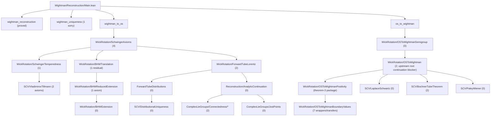

# OSReconstruction

A Lean 4 formalization of the **Osterwalder-Schrader reconstruction theorem** and supporting infrastructure in **von Neumann algebra theory**, built on [Mathlib](https://github.com/leanprover-community/mathlib4).

## Current Axiom Inventory

The tracked production tree currently contains **6 explicit axioms**:
- `schwartz_nuclear_extension` in `Wightman/WightmanAxioms.lean`
- `exists_continuousMultilinear_ofSeparatelyContinuous` in `Wightman/WightmanAxioms.lean`
- `vladimirov_tillmann` in `SCV/VladimirovTillmann.lean`
- `distributional_cluster_lifts_to_tube` in `SCV/VladimirovTillmann.lean` — distributional cluster on tube boundary lifts to pointwise cluster on tube interior (Poisson integral + Riemann-Lebesgue)
- `tube_boundaryValueData_of_polyGrowth` in `SCV/TubeBoundaryValues.lean` — Vladimirov-style boundary-value existence on tube domains from global polynomial growth
- `reduced_bargmann_hall_wightman_of_input` in `Wightman/Reconstruction/WickRotation/BHWReducedExtension.lean`

The first two are downstream reconstruction-facing functional-analysis surfaces
on the Wightman/Schwartz side. The docs now treat them with an explicit
three-layer ownership split:
1. checked local support work in `Wightman/NuclearSpaces/*`,
2. any optional bridge/import packaging (for example from `gaussian-field`),
3. the downstream exported consumer surfaces in `Wightman/WightmanAxioms.lean`.

So README should no longer be read as claiming that the upstream source has
already been fixed to one exact implementation route; the open problem is still
which bridge packages those local/imported ingredients into the downstream
reconstruction-facing theorem surfaces.

The next three are pure SCV / complex-analytic axioms on the tube-domain side:
Vladimirov-Tillmann growth, cluster lifting, and boundary-value existence from
global polynomial growth. The sixth is the reduced-coordinate Bargmann-Hall-Wightman
bridge on the Route 1 translation-invariance lane.

Two former axioms — `semigroupGroup_bochner` and `laplaceFourier_measure_unique`
(BCR Theorem 4.1.13) — have been **eliminated** by importing proved theorems from
[`mrdouglasny/hille-yosida`](https://github.com/mrdouglasny/hille-yosida) (0 sorrys, 0 custom axioms).

## Overview

This project formalizes the mathematical bridge between Euclidean and relativistic quantum field theory. The OS reconstruction theorem establishes that Schwinger functions (Euclidean correlators) satisfying certain axioms can be analytically continued to yield Wightman functions defining a relativistic QFT, and vice versa.

In the current formalization, the theorem surfaces are the corrected ones:
- `R -> E` lands on the honest zero-diagonal Euclidean Schwinger side, not an a priori full-Schwartz Euclidean extension.
- `E -> R` uses the corrected OS-II input, namely the OS axioms together with the explicit linear-growth condition.

## Canonical planning / status docs

Use the repo docs in the following order.

1. `docs/development_plan_systematic.md`
   - canonical blocker ordering and execution plan.
2. `docs/proof_docs_completion_plan.md`
   - canonical proof-doc hardening plan.
3. `docs/theorem2_locality_blueprint.md`
   - theorem-2 route contract.
4. `docs/theorem3_os_route_blueprint.md`
   - theorem-3 route contract. For implementation locus, read this together
     with `Wightman/Reconstruction/WickRotation/OSToWightmanPositivity.lean`:
     the exported theorem `bvt_W_positive` lives in
     `OSToWightmanBoundaryValues.lean`, but the actual Section-4.3
     transport/positivity package currently lives in `OSToWightmanPositivity.lean`
     (`bvt_W_eq_inner_on_positiveTimeTransport`,
     `bvt_W_positive_density_reduction`, `bvt_W_positive_direct`).
5. `docs/theorem4_cluster_blueprint.md`
   - theorem-4 route contract. Read this as a two-layer implementation target:
     the checked repo already contains the base cluster reductions in
     `OSToWightmanBoundaryValuesBase.lean`, while the still-missing explicit
     transport/adapter package sits above them and below the final private
     wrapper `OSToWightmanBoundaryValues.lean ::
     bvt_F_clusterCanonicalEventually_translate`.

`README.md` is intentionally only a high-level overview. The detailed live
frontier / blocker ledger should be read from the docs above, not reconstructed
from this file.

### Route Discipline

For OS-critical work, this repo follows the Osterwalder-Schrader reconstruction
route itself as closely as possible:
- zero-diagonal Euclidean test spaces are the honest Euclidean surface;
- the preferred `E -> R` path is the OS semigroup / Hilbert-space /
  analytic-continuation route;
- for `E -> R`, theorem shape should follow OS II Sections IV-VI: start from
  OS semigroup / Hilbert-space matrix elements, continue holomorphically, and
  recover Wightman data as Lorentzian boundary values of that common
  holomorphic object;
- stronger standalone Euclidean kernel-representation statements may be studied
  in `test/` or `Proofideas/`, but they are not to replace the OS route in
  production unless explicitly approved;
- convenience shortcuts that change category are also out of bounds in
  production: if OS stays in Hilbert-space, scalar matrix-element, or
  distributional language, we stay there too unless explicitly approved
  otherwise;
- same-test-function cross-domain equalities are banned by default in
  production. In particular, no theorem of the form `W_n(f) = S_n(f)` may be
  introduced unless there is already an explicit proved transport theorem
  identifying the Lorentzian test object, the Euclidean test object, and the
  exact map between them;
- shared Lean packaging such as `SchwartzNPoint`, common shell constructors,
  or coordinate-level reuse does not count as semantic justification for
  comparing Euclidean and Minkowski quantities on the "same" test function;
- if a production comparison theorem mixes OS and Wightman objects, the bridge
  must be named explicitly: either an OS-paper theorem, an exact local bridge
  theorem, or a named holomorphic continuation / boundary-value object already
  present in production;
- before touching a live OS-route `sorry`, the exact OS paper target must be
  stated explicitly: theorem/lemma/corollary number if one exists, plus page
  number. If the step is only chapter-level and no numbered result has yet been
  pinned down, that uncertainty must be reported before proof work continues.

### Modules

- **`OSReconstruction.Wightman`** — Wightman axioms, Schwartz tensor products, Poincaré/Lorentz groups, spacetime geometry, GNS construction, analytic continuation (tube domains, Bargmann-Hall-Wightman, edge-of-the-wedge), Wick rotation, and the reconstruction theorems.

- **`OSReconstruction.vNA`** — Von Neumann algebra foundations: cyclic/separating vectors, predual theory, Tomita-Takesaki modular theory, modular automorphism groups, KMS condition, spectral theory via Riesz-Markov-Kakutani, unbounded self-adjoint operators, and Stone's theorem.

- **`OSReconstruction.SCV`** — Several complex variables infrastructure: polydiscs, iterated Cauchy integrals, Osgood's lemma, separately holomorphic implies jointly analytic (Hartogs), tube domain extension, identity theorems, distributional boundary values on tubes, Bochner tube theorem, Fourier-Laplace representation, and Paley-Wiener theorems. The issue-48 boundary-value blocker is now isolated as a pure SCV axiom in `TubeBoundaryValues.lean`; the remaining SCV theorem-level blocker is the local-to-global tube extension lane in `BochnerTubeTheorem.lean`.

- **`OSReconstruction.ComplexLieGroups`** — Complex Lie group theory for the Bargmann-Hall-Wightman theorem: GL(n;C)/SL(n;C)/SO(n;C) path-connectedness, complex Lorentz group and its path-connectedness via Wick rotation, Jost's lemma (Wick rotation maps spacelike configurations into the extended tube), and the BHW theorem structure (extended tube, complex Lorentz invariance, permutation symmetry, uniqueness).

### Dependencies

- [**gaussian-field**](https://github.com/mrdouglasny/gaussian-field) — Sorry-free Hermite function basis, Schwartz-Hermite expansion, Dynin-Mityagin and Pietsch nuclear space definitions, spectral theorem for compact self-adjoint operators, nuclear SVD, and Gaussian measure construction on weak duals.

## Building

Requires [Lean 4](https://lean-lang.org/) and [Lake](https://github.com/leanprover/lean4/tree/master/src/lake).

```bash
lake build
```

For targeted verification, the most useful entry build is usually:

```bash
lake build OSReconstruction.Wightman.Reconstruction.Main
```

This fetches Mathlib and dependencies automatically on first build.

## Entrypoints

- `import OSReconstruction` or `import OSReconstruction.OS`
  OS-critical umbrella: the Wightman/SCV/Complex-Lie-group reconstruction stack,
  excluding the broader `vNA` lane.
- `import OSReconstruction.All`
  Full umbrella: OS-critical path plus the `vNA` development.
- `import OSReconstruction.Wightman.Reconstruction.Main`
  Top-level theorem wiring for `wightman_reconstruction`, `wightman_to_os`,
  and `os_to_wightman`.
- `import OSReconstruction.Wightman.Reconstruction.WickRotation`
  Barrel for the Wick-rotation bridge files.
- `import OSReconstruction.vNA`
  Operator-theoretic lane only.

## Project Status

Authoritative detailed blocker ordering now lives in
`docs/development_plan_systematic.md`; the snapshot below is only a high-level
overview.

The tracked production tree currently includes **6 explicit `axiom`
declarations**:
- `schwartz_nuclear_extension` in `Wightman/WightmanAxioms.lean`
- `exists_continuousMultilinear_ofSeparatelyContinuous` in `Wightman/WightmanAxioms.lean`
- `vladimirov_tillmann` in `SCV/VladimirovTillmann.lean`
- `distributional_cluster_lifts_to_tube` in `SCV/VladimirovTillmann.lean`
- `tube_boundaryValueData_of_polyGrowth` in `SCV/TubeBoundaryValues.lean`
- `reduced_bargmann_hall_wightman_of_input` in `Wightman/Reconstruction/WickRotation/BHWReducedExtension.lean`

The first two are downstream functional-analysis consumer surfaces on the
Wightman/Schwartz side (Schwartz kernel theorem and Banach-Steinhaus for finite
multilinear maps), but later Lean work must keep their ownership split explicit:
checked local support in `Wightman/NuclearSpaces/*`, optional bridge/import
packaging, and only then the exported `Wightman/WightmanAxioms.lean` surfaces
consumed by reconstruction files. The next three are pure SCV tube-domain
axioms: growth, cluster lifting, and boundary-value existence. The sixth is the
deferred reduced-BHW bridge on the Route 1 translation-invariance lane.
Remaining work outside these deferred surfaces is represented by explicit
theorem-level `sorry` placeholders.
The snapshot below counts only tracked production files; local scratch under
`Proofideas/` and other untracked experiments are intentionally excluded.

Current blocker map:
- The analyticity-critical `E -> R` path is the split
  `WickRotation/OSToWightmanSemigroup.lean` ->
  `WickRotation/OSToWightman.lean` ->
  `WickRotation/OSToWightmanPositivity.lean` ->
  `WickRotation/OSToWightmanBoundaryValues.lean`.
- The zero-diagonal `R -> E` temperedness front has been split out of the old
  `SchwingerAxioms.lean` monolith into
  `WickRotation/SchwingerTemperedness.lean`, so the live E0 `sorry`s now sit in
  a small dedicated file rather than in a >3000-line axiom file.
- Route 1 translation invariance is now merged in production:
  `bhw_translation_invariant` is proved in `WickRotation/BHWTranslation.lean`,
  backed by one deferred reduced-BHW bridge axiom in
  `WickRotation/BHWReducedExtension.lean`.
- The same cleanup has been applied on the `vNA` side: the open positive-power /
  unitary-group lane has been split from `vNA/Unbounded/Spectral.lean` into
  `vNA/Unbounded/SpectralPowers.lean`, leaving the core spectral-construction
  file sorry-free on the moved tail.
- `OSToWightmanSemigroup.lean` is the established OS semigroup/spectral/Laplace
  and one-variable holomorphic layer.
- `OSToWightman.lean :: schwinger_continuation_base_step` remains the upstream
  root continuation blocker on the `E -> R` lane, but it is **not** the
  theorem-2 frontier itself.
- The live theorem-2 frontier is now
  `OSReconstruction/Wightman/Reconstruction/WickRotation/OSToWightmanBoundaryValues.lean ::
  bvt_F_swapCanonical_pairing`, with the route contract fixed by
  `docs/theorem2_locality_blueprint.md`.
- Inside that theorem-2 contract, the raw-boundary instantiation is now to be
  read literally on the primary Route-B open-edge package
  (`choose_real_open_edge_for_adjacent_swap` ->
  `swapped_support_lies_in_swapped_open_edge` ->
  `swapped_open_edge_embeds_in_extendedTube`), not as a late switch back to a
  forward-Jost-only Route-A endgame script.
- The theorem-2 docs now also fix file ownership of that closing package: the
  Route-B ET-support geometry belongs in the checked BHW-permutation support
  subfile layer rather than the umbrella barrel by default. More precisely,
  `ComplexLieGroups/Connectedness/BHWPermutation/Adjacency.lean` is the
  pointwise/open-edge adjacent-swap support file and
  `.../AdjacencyDistributional.lean` is the checked distributional pairing
  surface consumed by theorem 2; `ComplexLieGroups/Connectedness/BHWPermutation.lean`
  remains only the lane entry point unless the docs are rewritten. The checked
  tree now fixes the lower geometry supplier more sharply too:
  `Adjacency.lean :: exists_real_open_nhds_adjSwap` already owns the local
  compactness/open-neighborhood package for a real adjacent-swap edge, so the
  theorem-2-facing wrapper `choose_real_open_edge_for_adjacent_swap` should be
  read as a still-missing support-inclusion wrapper on top of that checked
  helper rather than as a request to rediscover the local open-edge proof from
  scratch. Even more sharply, the wrapper split is now explicit at proof-
  transcript level: `choose_real_open_edge_for_adjacent_swap` owns the compact-
  support finite-cover packaging, `swapped_support_lies_in_swapped_open_edge`
  is support transport only, and `swapped_open_edge_embeds_in_extendedTube` is
  ET transport only. The raw-boundary wrapper belongs beside
  `WickRotation/BHWExtension.lean :: W_analytic_swap_boundary_pairing_eq`,
  the canonical-shift adapter and the general-swap adjacent-chain reducer
  `bvt_F_swapCanonical_pairing_of_adjacent_chain` belong in
  `WickRotation/OSToWightmanBoundaryValueLimits.lean`, and
  `OSToWightmanBoundaryValues.lean :: bvt_F_swapCanonical_pairing` should stay
  only as the thin frontier consumer. Checked-file caution: that
  `BoundaryValueLimits.lean` file is present in the current tree, but at
  present it still contains only theorem-3-side `singleSplit_xiShift` /
  positive-time limit machinery. The theorem-2 canonical-direction package is
  therefore planned support work inside an existing file, and must be added as
  a separate sibling layer rather than by quietly reusing the existing
  positivity shell as if it were already a theorem-2 boundary-recovery theorem.
- The theorem-2 route is now fixed at one explicit package order rather than a
  vague "locality from BHW" slogan:
  `choose_real_open_edge_for_adjacent_swap`
  -> `swapped_support_lies_in_swapped_open_edge`
  -> `swapped_open_edge_embeds_in_extendedTube`
  -> `bvt_F_hasFlatRegularRepr`
  -> `bvt_F_boundary_continuous_at_real_support`
  -> `bvt_F_adjacentSwap_boundary_pairing_eq_of_ET_support`
  -> `bvt_F_canonical_boundary_pairing_eq_from_bv_recovery`
  -> `bvt_F_adjacentSwapCanonical_pairing_from_raw_boundary_locality`
  -> `bvt_F_swapCanonical_pairing_of_adjacent_chain`
  -> `bvt_F_swapCanonical_pairing`.
  This adjacent-only/core versus general-swap/frontier split is now part of the
  doc contract because the checked raw-boundary theorem surface is adjacent
  only, while the frontier theorem still uses general `swap i j`. A forward-
  Jost upgrade remains blocked-only fallback unless a checked production theorem
  first makes it available.
- More sharply, the raw-boundary -> canonical-shift bridge is no longer to be
  read as an unspecified rewrite miracle. The checked tree already contains the
  forward-tube boundary-recovery theorems
  `ForwardTubeDistributions.lean ::
  boundary_value_recovery_forwardTube_of_flatRegular` and
  `boundary_value_recovery_forwardTube_of_flatRegular_from_bv`; the remaining
  theorem-2 adapter gap is now split explicitly into two missing theorem
  packages: the theorem-2-specific canonical pairing recovery specialization
  `bvt_F_canonical_boundary_pairing_eq_from_bv_recovery` at
  `canonicalForwardConeDirection`, and the separate gluing theorem
  `bvt_F_adjacentSwapCanonical_pairing_from_raw_boundary_locality`. It is not
  a search for some separate hidden raw/canonical rewrite layer.
- Another theorem-2 doc correction is now explicit too: the checked public BHW
  wrapper `W_analytic_swap_boundary_pairing_eq` is not directly the raw-
  boundary theorem-2 closure theorem, because its theorem surface asks for
  `hLC : IsLocallyCommutativeWeak d W`. On the theorem-2 lane, taking
  `W := bvt_W OS lgc` would make that input circular. A direct source check now
  records one sharper fact: the lower theorem
  `AdjacencyDistributional.lean ::
  extendF_adjSwap_pairing_eq_of_distributional_local_commutativity` still asks
  for the same `IsLocallyCommutativeWeak` input. So the actual missing theorem-
  2 raw-boundary package is not merely "drop to the lower theorem". After
  checking the surrounding theorem-2 surfaces, the docs now freeze one unique
  closure shape: introduce the explicitly named adjacent-only substitute
  consumer theorem
  `adjacent_boundary_pairing_eq_of_openEdgeBoundaryCompatibility`, exported
  from `AdjacencyDistributional.lean` / `BHWExtension.lean` with statement home
  in `BHWExtension.lean`. Its proof transcript is also fixed: pointwise
  `analytic_boundary_local_commutativity_of_boundary_continuous` on the chosen
  Route-B edge -> compact-support integrand equality -> pairing equality. The
  theorem-2 lane no longer leaves open a second endorsed route that first
  proves the stronger full-global theorem
  `IsLocallyCommutativeWeak d (bvt_W OS lgc)`.
- The checked file `OSToWightmanBoundaryValueLimits.lean` now has a sharper
  doc-level ownership contract too. In the live tree it is still a theorem-3
  `singleSplit_xiShift` / `t → 0+` limit file, so theorem-2 support there must
  be added as a new sibling subsection in the exact local order
  `bvt_F_canonical_boundary_pairing_eq_from_bv_recovery`
  -> `bvt_F_adjacentSwapCanonical_pairing_from_raw_boundary_locality`
  -> `bvt_F_swapCanonical_pairing_of_adjacent_chain`. Later Lean work should
  not guess where that package begins or ends, and should not treat the
  existing positivity shell as if it already closed theorem 2. More sharply,
  this sibling subsection starts only after the adjacent-only raw-boundary
  theorem has already been closed on the `BHWExtension.lean` side via
  `adjacent_boundary_pairing_eq_of_openEdgeBoundaryCompatibility` and then
  packaged in `bvt_F_adjacentSwap_boundary_pairing_eq_of_ET_support`; the
  `OSToWightmanBoundaryValueLimits.lean` lane is canonical-shift recovery,
  gluing, and adjacent-chain reduction only, not a second home for the raw-
  boundary closure theorem.
- That specialization contract is now also fixed at the boundary-functional
  level: it must instantiate
  `boundary_value_recovery_forwardTube_of_flatRegular_from_bv` with
  `OSToWightmanBoundaryValuesBase.lean :: bvt_W` as `T`,
  `bvt_W_continuous` as the continuity witness, and `bvt_boundary_values` as
  the boundary-value input. So the honest remaining theorem-2 adapter work is
  a theorem-2-specific specialization/gluing step, not a search for a new
  boundary functional or a new continuity theorem.
- The theorem-2 docs now also separate checked-present theorem surfaces from
  planned theorem-package names: the current repo already has
  `W_analytic_swap_boundary_pairing_eq`,
  `extendF_adjSwap_pairing_eq_of_distributional_local_commutativity`,
  `analytic_boundary_local_commutativity_of_boundary_continuous`,
  `boundary_function_continuous_forwardTube_of_flatRegular`,
  `bvt_F_holomorphic`, `bvt_boundary_values`, and
  `bv_local_commutativity_transfer_of_swap_pairing`, while names such as
  `choose_real_open_edge_for_adjacent_swap`,
  `adjacent_boundary_pairing_eq_of_openEdgeBoundaryCompatibility`,
  `bvt_F_adjacentSwap_boundary_pairing_eq_of_ET_support`,
  `bvt_F_adjacentSwapCanonical_pairing_from_raw_boundary_locality`, and
  `bvt_F_swapCanonical_pairing_of_adjacent_chain` are still
  documentation-contract targets rather than already-implemented helpers.
- More sharply, the theorem-2 continuity lane no longer treats the flattened
  regular package as a vague three-input mystery. The checked tree now splits
  the unflattened supplier lane by visibility:
  - public theorem surfaces in `OSToWightmanBoundaryValuesBase.lean`:
    `boundary_values_tempered`, `bvt_F_holomorphic`, `bvt_boundary_values`;
  - private in-file packaging theorems in the same file:
    `forwardTube_boundaryValueData_of_polyGrowth` and
    `full_analytic_continuation_boundaryValueData`.
  The checked upstream public growth source is still
  `OSToWightman.lean :: full_analytic_continuation_with_symmetry_growth`, and
  the checked extraction pattern is now explicit too: the live growth package
  is the tail field
  `(full_analytic_continuation_with_symmetry_growth OS lgc n).choose_spec.2.2.2.2.2`
  after the holomorphy / Euclidean restriction / permutation invariance /
  translation invariance / canonical-star fields. The designated source-to-slot
  map is now explicit too:
  `bvt_F_holomorphic -> bvt_F_flattened_holomorphic`,
  `bvt_boundary_values -> bvt_F_flattened_distribution_boundary`, and the
  explicit growth field exported by
  `full_analytic_continuation_with_symmetry_growth -> bvt_F_flattened_growth`.
  `boundary_values_tempered` remains the broader public existence theorem, not
  the designated source surface for the flattened boundary-distribution slot.
  In the checked tree that growth source is already a concrete field of the
  chosen `bvt_F` witness (`∃ C_bd N, 0 < C_bd ∧ ∀ z ∈ ForwardTube d n,
  ‖bvt_F z‖ ≤ C_bd * (1 + ‖z‖) ^ N`), and the private packaging theorem
  `OSToWightmanBoundaryValuesBase.lean ::
  full_analytic_continuation_boundaryValueData` already unpacks it on the
  unflattened side. So the real open doc-level gap is now only the flattened
  polynomial-growth transport together with the new regular constructor
  `flatRegular_of_boundary_distribution_and_polyGrowth`, and that missing
  constructor work belongs on the `ForwardTubeDistributions.lean` side of the
  stack rather than inside the final locality frontier theorem file. Inside
  that continuity subpackage, the active theorem-slot vocabulary is now fixed
  at `bvt_F_flattened_holomorphic`,
  `bvt_F_flattened_distribution_boundary`, and `bvt_F_flattened_growth`; older
  flipped draft names of the form `flattened_bvt_F_*` should be read as stale
  doc vocabulary, not alternative implementation targets.
- Inside that theorem-2 contract, the primary raw-boundary locality theorem
  surface is now explicitly the checked public theorem
  `WickRotation/BHWExtension.lean :: W_analytic_swap_boundary_pairing_eq`.
  Its implementation already reduces to the lower ET-support distributional
  theorem
  `ComplexLieGroups/Connectedness/BHWPermutation/AdjacencyDistributional.lean ::
  extendF_adjSwap_pairing_eq_of_distributional_local_commutativity`, so the
  theorem-2 docs should not be read as offering two co-primary raw-boundary
  closure routes.
- The active theorem-2/3/4 contracts are now tracked directly by
  `docs/theorem2_locality_blueprint.md`,
  `docs/theorem3_os_route_blueprint.md`, and
  `docs/theorem4_cluster_blueprint.md` rather than by older K2VI1-only status
  language.
- The theorem-3 frontier is the Section-4.3 transport/positivity package in
  `OSToWightmanPositivity.lean`, with the exact live theorem-package seam named
  by
  `bvt_W_eq_inner_on_positiveTimeTransport`,
  `bvt_W_positive_density_reduction`, and
  `bvt_W_positive_direct`; the private theorem
  `OSToWightmanBoundaryValues.lean :: bvt_W_positive` is the exported wrapper,
  not the implementation locus.
- The theorem-4 frontier is no longer to be read as only the final private
  wrapper `bvt_cluster`. The checked repo already contains the base cluster
  reductions in `OSToWightmanBoundaryValuesBase.lean`, while the still-missing
  corrected bridge / public canonical-shell adapter package sits between those
  reductions and the final private wrapper
  `OSToWightmanBoundaryValues.lean :: bvt_F_clusterCanonicalEventually_translate`.
  The intended adapter order is now explicit in
  `docs/theorem4_cluster_blueprint.md`:
  `canonical_cluster_integrand_eq_singleSplit_integrand`
  -> `canonical_translate_factor_eq_singleSplit_translate_factor`
  -> `singleSplit_core_rewrites_to_canonical_shell`
  -> `canonical_shell_limit_of_rewrite`
  -> `bvt_cluster_canonical_from_positiveTime_core`.
- `WickRotation/K2VI1/*` remains important support infrastructure and theorem-1
  history, but it is not the canonical current blocker ledger for the theorem
  2/3/4 documentation stack.
- Downstream of theorem 2/3/4, `boundary_values_tempered` and the remaining
  transfer chain in `OSToWightmanBoundaryValues.lean` still need the genuine
  growth inputs from `OSLinearGrowthCondition`.
- On the merged `R -> E` path, the theorem-level front blockers have moved
  downstream past `BHWTranslation.lean`. The live front is now the
  zero-diagonal continuity theorem in `SchwingerTemperedness.lean`; the
  integrability side is now discharged via the VT axiom.
- After that, the remaining theorem-level `R -> E` blockers are the analytic
  ones in `SchwingerAxioms.lean`, especially the OS=W term, Euclidean
  reality/reflection, and the cluster bridge.
- `isPreconnected_baseFiber` remains in `WickRotation/BHWTranslation.lean` as
  an old-route residual theorem, but it is no longer the blocker used to obtain
  `bhw_translation_invariant` on the merged path.
- `ForwardTubeLorentz.lean` still carries the two upstream analytic-geometry
  `sorry`s needed by the BHW/Wick-rotation lane.
- `StoneTheorem` and the broader `vNA` operator lane matter for the separate
  GNS/operator reconstruction theorem `wightman_reconstruction`, but not for the
  current Wick-rotation critical path.

### Current Operational Blockers

- `E -> R`:
  the near-term upstream continuation goal is still to close
  `OSReconstruction/Wightman/Reconstruction/WickRotation/OSToWightman.lean ::
  schwinger_continuation_base_step` on the honest zero-diagonal/two-point
  Schwinger domain.
- `E -> R` theorem-package frontiers:
  theorem 2 now means
  `OSReconstruction/Wightman/Reconstruction/WickRotation/OSToWightmanBoundaryValues.lean ::
  bvt_F_swapCanonical_pairing` (locality boundary-pairing adapter), theorem 3
  means the Section-4.3 transport package in `OSToWightmanPositivity.lean`, and
  theorem 4 means the corrected bridge plus public canonical-shell adapter
  package above the cluster reductions.
- `E -> R` downstream:
  after those theorem-specific seams, `OSToWightmanBoundaryValues.lean` still
  carries `boundary_values_tempered`, the transfer chain, and the final cluster
  wrapper layer.
- `R -> E`:
  the live front is the zero-diagonal continuity theorem in
  `SchwingerTemperedness.lean`; the integrability side now uses the VT axiom.
- `R -> E` downstream:
  `SchwingerAxioms.lean` still contains the remaining analytic Wick-rotation
  obligations after temperedness is in place.

Snapshot (2026-04-07, tracked production tree):

| Module | Direct `sorry` lines |
|--------|-----------------------|
| `Wightman/` | 23 |
| `SCV/` | 2 |
| `ComplexLieGroups/` | 2 |
| `vNA/` | 36 |
| **Total** | **63** |

Tracked production tree also contains `6` explicit axioms:
- `schwartz_nuclear_extension`
- `exists_continuousMultilinear_ofSeparatelyContinuous`
- `vladimirov_tillmann`
- `distributional_cluster_lifts_to_tube`
- `tube_boundaryValueData_of_polyGrowth`
- `reduced_bargmann_hall_wightman_of_input`

### OS-Critical Sorry Flow Toward Reconstruction



### Critical-Path Blockers (File Level)

| File | Direct `sorry`s | Notes |
|------|------------------|-------|
| `Wightman/Reconstruction/Main.lean` | 1 | `wightman_uniqueness` |
| `Wightman/WightmanAxioms.lean` | 0 + 2 axioms | Schwartz kernel theorem + Banach-Steinhaus bridge are now explicit axioms |
| `SCV/VladimirovTillmann.lean` | 0 + 2 axioms | Vladimirov-Tillmann tube-growth theorem + distributional cluster lifts to tube |
| `Wightman/NuclearSpaces/*` | checked local support lane, but not yet fully integrated into downstream reconstruction consumers | the checked tree here contains a live `Wightman/NuclearSpaces/` subtree (`NuclearSpace.lean`, `SchwartzNuclear.lean`, `GaussianFieldBridge.lean`, `BochnerMinlos.lean`, `EuclideanMeasure.lean`, `ComplexSchwartz.lean`); docs must distinguish those checked support files from the still-exported downstream axioms in `Wightman/WightmanAxioms.lean` and from any remaining import/integration gaps |
| `Wightman/Reconstruction/ForwardTubeDistributions.lean` | 0 | distributional uniqueness / boundary-value lane complete |
| `Wightman/Reconstruction/WickRotation/ForwardTubeLorentz.lean` | 2 | polynomial growth slice + PET measure-zero step |
| `Wightman/Reconstruction/WickRotation/BHWExtension.lean` | 0 | honest distributional adjacent-swap lane complete |
| `Wightman/Reconstruction/WickRotation/BHWTranslation.lean` | 1 | old-route base-fiber residual; merged path uses Route 1 reduced coordinates |
| `Wightman/Reconstruction/WickRotation/BHWReducedExtension.lean` | 0 + 1 axiom | deferred reduced BHW bridge theorem |
| `Wightman/Reconstruction/WickRotation/SchwingerTemperedness.lean` | 1 | zero-diagonal continuity front; integrability now uses the VT axiom |
| `Wightman/Reconstruction/WickRotation/SchwingerAxioms.lean` | 4 | OS=W term, reality/reflection, cluster |
| `Wightman/Reconstruction/WickRotation/OSToWightmanSemigroup.lean` | 0 | OS semigroup, spectral/Laplace bridge, one-variable holomorphic infrastructure |
| `Wightman/Reconstruction/WickRotation/OSToWightman.lean` | 2 | upstream root continuation blocker: `schwinger_continuation_base_step` |
| `Wightman/Reconstruction/WickRotation/OSToWightmanPositivity.lean` | 4 | theorem-3 Section-4.3 transport/positivity package (`bvt_W_eq_inner_on_positiveTimeTransport`, `bvt_W_positive_density_reduction`, `bvt_W_positive_direct`) |
| `Wightman/Reconstruction/WickRotation/K2VI1/Frontier.lean` | 3 | residual/support frontier from the earlier split `k = 2` route; not the canonical theorem-2/3/4 blocker ledger |
| `Wightman/Reconstruction/WickRotation/OSToWightmanBoundaryValues.lean` | 7 | exported wrappers, tempered boundary values, transfer chain, cluster |
| `SCV/LaplaceSchwartz.lean` | 0 | generic tempered boundary-value lemmas extracted |
| `SCV/TubeDistributions.lean` | 0 | sorry-free |
| `SCV/BochnerTubeTheorem.lean` | 2 | local-to-global tube extension |
| `SCV/PaleyWiener.lean` | 0 | sorry-free |
| `ComplexLieGroups/Connectedness/BHWPermutation/PermutationFlowBlocker.lean` | 2 | permutation-flow blockers |
| `vNA/MeasureTheory/CaratheodoryExtension.lean` | 11 | measure-theoretic extension lane |
| `vNA/KMS.lean` | 10 | KMS/modular theory lane |
| `vNA/ModularAutomorphism.lean` | 7 | modular automorphism theory |
| `vNA/ModularTheory.lean` | 6 | Tomita-Takesaki core |
| `vNA/Unbounded/StoneTheorem.lean` | 2 | Stone/self-adjoint generator lane |
| `vNA/Unbounded/SpectralPowers.lean` | 2 | positive powers / unitary-group lane |
| `vNA/Predual.lean` | 2 | normal functionals, sigma-weak topology |

Operator-theoretic side note:
- `Main.wightman_reconstruction` is a separate GNS/operator lane.
- The `StoneTheorem` file matters there, but not for the analyticity results in
  the `OSToWightman*` stack.
- The minimal Stone-side targets for that lane are the generator
  density/self-adjointness results feeding reconstructed `spectrum_condition`
  and `vacuum_unique`.

See also [`docs/development_plan_systematic.md`](docs/development_plan_systematic.md),
[`OSReconstruction/Wightman/TODO.md`](OSReconstruction/Wightman/TODO.md), and
[`OSReconstruction/ComplexLieGroups/TODO.md`](OSReconstruction/ComplexLieGroups/TODO.md)
for the synchronized execution plan.

## Repository Layout

The repository now has a clear barrel/module split at the top level. The layout
below is selective rather than exhaustive; it is meant as a navigation map for
the tracked production tree, not as a complete file listing.

```
.
├── OSReconstruction.lean                 # default umbrella = OS critical path
├── OSReconstruction/
│   ├── OS.lean                           # OS-critical umbrella (no vNA)
│   ├── All.lean                          # full umbrella (OS + vNA)
│   ├── Wightman.lean                     # Wightman/reconstruction umbrella
│   ├── SCV.lean                          # SCV umbrella
│   ├── ComplexLieGroups.lean             # BHW/Lorentz umbrella
│   ├── vNA.lean                          # vNA umbrella
│   ├── Bridge.lean                       # barrel for axiom-replacement bridge
│   ├── Bridge/
│   │   └── AxiomBridge.lean              # type/axiom bridges between SCV, BHW, Wightman
│   ├── Wightman/
│   │   ├── Basic.lean                    # core Wightman-side definitions
│   │   ├── WightmanAxioms.lean           # Wightman function axioms and extension surfaces
│   │   ├── OperatorDistribution.lean     # operator-valued distributions
│   │   ├── SchwartzTensorProduct.lean    # Schwartz tensor products and insertion CLMs
│   │   ├── Reconstruction.lean           # stable reconstruction barrel
│   │   ├── ReconstructionBridge.lean     # wires WickRotation to theorem surface
│   │   └── Reconstruction/
│   │       ├── Core.lean                 # shared core OS/Wightman reconstruction objects
│   │       ├── SchwingerOS.lean          # Schwinger-side / zero-diagonal OS layer
│   │       ├── Poincare1D.lean           # 1D Schwartz Poincare lemma
│   │       ├── SliceIntegral.lean        # Schwartz slice-integral infrastructure
│   │       ├── BlockIntegral.lean        # finite-block flattening and iterated slice integration
│   │       ├── ZeroMeanFourierTransport.lean # zero-mean transport infrastructure
│   │       ├── TranslationInvariantSchwartz.lean # zero-mean decomposition + translation classification
│   │       ├── HeadTranslationInvariant.lean # one active-variable factorization through sliceIntegral
│   │       ├── HeadBlockTranslationInvariant.lean # block factorization through integrateHeadBlock
│   │       ├── CenterSpatialTranslationInvariant.lean # center-spatial descent to reduced (u_time, ξ)
│   │       ├── TwoPointDescent.lean      # center/difference descent for two-point Schwartz tests
│   │       ├── TwoPointKernelFunctional.lean # kernel CLM on the reduced two-point lane
│   │       ├── WightmanTwoPoint.lean     # two-point Wightman center/difference reduction
│   │       ├── GNSConstruction.lean      # GNS construction
│   │       ├── GNSHilbertSpace.lean      # reconstructed Hilbert space and field action
│   │       ├── PoincareAction.lean       # Poincare action on test-function sequences
│   │       ├── PoincareRep.lean          # n-point Poincare representations
│   │       ├── AnalyticContinuation.lean # forward tube, BHW, EOW abstract surface
│   │       ├── DenseCLM.lean             # dense-set extension lemmas for continuous linear maps
│   │       ├── ForwardTubeDistributions.lean # distributional forward-tube boundary values
│   │       ├── PartialToTotal.lean       # partial-to-total extension helpers
│   │       ├── ProductStoneWeierstrass.lean # compact product density via Stone-Weierstrass
│   │       ├── SchwartzCutoff.lean       # cutoff / vanishing-on-ball Schwartz estimates
│   │       ├── SchwartzDensity.lean      # compact-support Schwartz density tools
│   │       ├── SchwartzPartialEval.lean  # continuity of Schwartz partial evaluation
│   │       ├── Main.lean                 # top-level theorem wiring
│   │       ├── WickRotation.lean         # barrel for Wick-rotation bridge files
│   │       ├── Helpers/                  # auxiliary separately-analytic / EOW helpers
│   │       └── WickRotation/
│   │           ├── BEGTrigonometric.lean       # trigonometric-side BEG support lemmas
│   │           ├── ForwardTubeLorentz.lean      # Lorentz covariance on the tube
│   │           ├── BHWReduced.lean             # reduced-coordinate Route 1 infrastructure
│   │           ├── BHWReducedExtension.lean    # reduced BHW bridge theorem surface
│   │           ├── BaseFiberInflation.lean      # forward-tube/Lorentz inflation helpers
│   │           ├── BHWExtension.lean            # BHW extension / adjacent-swap layer
│   │           ├── BHWTranslation.lean          # translation-invariance transfer
│   │           ├── BHWTranslationCore.lean      # shared Route 1 translation core
│   │           ├── HermitianBoundaryPairing.lean # rapidity-reduced partner BV pairing
│   │           ├── SchwingerAxioms.lean         # R -> E Wick-rotation axioms
│   │           ├── OSToWightmanSemigroup.lean   # OS semigroup, spectral/Laplace, 1-variable holomorphy
│   │           ├── OSToWightman.lean            # older continuation core / legacy support lane
│   │           ├── OSToWightmanK2BaseStep.lean  # specialized k=2 base-step infrastructure
│   │           ├── K2VI1/Support.lean           # proved support stack for the split k=2 VI.1 frontier
│   │           ├── K2VI1/InputA*.lean           # fixed-time / shell / representative / uniqueness reductions
│   │           ├── K2VI1/Bounds.lean            # direct OS-side norm / matrix-element bounds for VI.1
│   │           ├── K2VI1/Damping.lean           # damped probe bounds on the original shell
│   │           ├── K2VI1/DampedNorm.lean        # uniform damped diagonal / DCT domination layer
│   │           ├── K2VI1/Regularization*.lean   # reflected regularization / seminorm / orbit-control stack
│   │           ├── K2VI1/OrbitBridge.lean       # scalar boundary/orbit bridge on the direct VI.1 route
│   │           ├── K2VI1/DCT.lean               # dominated-convergence packaging for the frontier
│   │           ├── K2VI1/Frontier.lean          # small live k=2 VI.1 frontier file
│   │           ├── OSToWightmanSpatialMomentum.lean # one-point semigroup-group spectral bridge
│   │           ├── SchwingerTemperedness.lean   # zero-diagonal temperedness front; VT-backed growth/integrability
│   │           ├── WickRotationBridge.lean      # small Wick-rotation differentiability helpers
│   │           └── OSToWightmanBoundaryValues.lean # tempered BV package and axiom transfer
│   ├── SCV/
│   │   ├── Analyticity.lean             # basic analyticity lemmas and wrappers
│   │   ├── Polydisc.lean                 # polydisc geometry
│   │   ├── IteratedCauchyIntegral.lean   # multivariable Cauchy integrals
│   │   ├── Osgood.lean                   # Osgood's lemma
│   │   ├── SeparatelyAnalytic.lean       # separate -> joint analytic infrastructure
│   │   ├── EdgeOfWedge.lean              # 1D EOW infrastructure
│   │   ├── EOWMultiDim.lean              # multidimensional EOW helpers
│   │   ├── FourierLaplaceCore.lean       # core Fourier-Laplace transforms on tubes
│   │   ├── IdentityTheorem.lean          # identity theorem infrastructure
│   │   ├── TubeDomainExtension.lean      # tube-domain extension results
│   │   ├── TubeDistributions.lean        # distributional boundary values on tubes
│   │   ├── DistributionalUniqueness.lean # tube uniqueness from zero boundary value
│   │   ├── MultipleReflection.lean       # reflection identities for boundary values
│   │   ├── SchwartzComplete.lean         # completeness / Fréchet-side Schwartz facts
│   │   ├── SemigroupBochner.lean         # semigroup-positive-definite kernel infrastructure
│   │   ├── SemigroupGroupBochner.lean    # joint semigroup-group Bochner existence + uniqueness
│   │   ├── TotallyRealIdentity.lean      # totally-real identity / Schwarz-reflection tools
│   │   ├── LaplaceHolomorphic.lean       # half-plane Laplace holomorphy
│   │   ├── LaplaceSchwartz.lean          # tempered boundary-value/Fourier-Laplace package
│   │   ├── BochnerTubeTheorem.lean       # Bochner tube theorem
│   │   └── PaleyWiener.lean              # Paley-Wiener infrastructure
│   ├── ComplexLieGroups/
│   │   ├── MatrixLieGroup.lean           # GL/SL connectedness
│   │   ├── LorentzLieGroup.lean          # real Lorentz-group infrastructure
│   │   ├── Complexification.lean         # complex Lorentz group
│   │   ├── JostPoints.lean               # Jost-point geometry / Wick rotation
│   │   └── Connectedness/                # BHW connectedness and permutation flow
│   └── vNA/
│       ├── Basic.lean                    # basic vNA infrastructure
│       ├── Predual.lean                  # normal functionals and sigma-weak topology
│       ├── Antilinear.lean               # antilinear operators
│       ├── ModularTheory.lean            # Tomita-Takesaki core
│       ├── ModularAutomorphism.lean      # modular automorphism group
│       ├── KMS.lean                      # KMS condition
│       ├── Bochner/                      # bounded functional calculus / operator Bochner layer
│       ├── Spectral/                     # bounded spectral-theorem via RMK lane
│       ├── Unbounded/                    # unbounded operators, spectral theorem, Stone
│       └── MeasureTheory/                # spectral integrals, Stieltjes, Caratheodory
└── docs/                                 # synchronized development plans
```

Two navigation notes:
- `Wightman/Reconstruction.lean` is now the stable reconstruction barrel. The
  shared core definitions live in `Wightman/Reconstruction/Core.lean`, and the
  Schwinger/OS-side reduction layer lives in
  `Wightman/Reconstruction/SchwingerOS.lean`. The new finite-block descent
  helpers are split out into `BlockIntegral.lean`, `HeadBlockTranslationInvariant.lean`,
  `CenterSpatialTranslationInvariant.lean`, and `TwoPointDescent.lean` so the
  Wick-rotation files do not keep absorbing low-level coordinate bookkeeping.
- `Wightman/Reconstruction/Main.lean` only wires the top-level theorems.
- Checked-tree caution: older planning docs still mention historical
  `Wightman/Groups/` and `Wightman/Spacetime/` subtrees, but those directories
  are not present in the current checked tree of this clone. By contrast,
  `Wightman/NuclearSpaces/` **is** present and should be treated as a real local
  support lane. For implementation work, prefer the concrete file inventory in
  the tree above over any older path vocabulary.
- The live `E -> R` lane is intentionally split across
  `OSToWightmanSemigroup.lean`, `OSToWightman.lean`, and
  `OSToWightmanBoundaryValues.lean`. Older kernel / specialized-two-point
  detours are deprecated and are no longer part of the production route.

## References

- Osterwalder-Schrader, "Axioms for Euclidean Green's Functions" I & II (1973, 1975)
- Streater-Wightman, "PCT, Spin and Statistics, and All That"
- Glimm-Jaffe, "Quantum Physics: A Functional Integral Point of View"
- Reed-Simon, "Methods of Modern Mathematical Physics" I
- Takesaki, "Theory of Operator Algebras" I, II, III

## License

This project is licensed under the Apache License 2.0 — see [LICENSE](LICENSE) for details.
