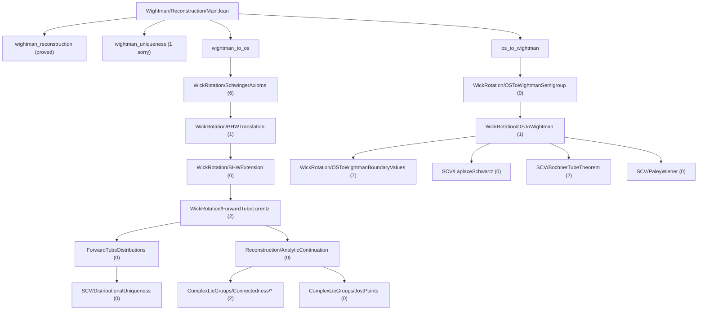

# OSReconstruction

A Lean 4 formalization of the **Osterwalder-Schrader reconstruction theorem** and supporting infrastructure in **von Neumann algebra theory**, built on [Mathlib](https://github.com/leanprover-community/mathlib4).

## Overview

This project formalizes the mathematical bridge between Euclidean and relativistic quantum field theory. The OS reconstruction theorem establishes that Schwinger functions (Euclidean correlators) satisfying certain axioms can be analytically continued to yield Wightman functions defining a relativistic QFT, and vice versa.

In the current formalization, the theorem surfaces are the corrected ones:
- `R -> E` lands on the honest zero-diagonal Euclidean Schwinger side, not an a priori full-Schwartz Euclidean extension.
- `E -> R` uses the corrected OS-II input, namely the OS axioms together with the explicit linear-growth condition.

### Modules

- **`OSReconstruction.Wightman`** — Wightman axioms, Schwartz tensor products, Poincaré/Lorentz groups, spacetime geometry, GNS construction, analytic continuation (tube domains, Bargmann-Hall-Wightman, edge-of-the-wedge), Wick rotation, and the reconstruction theorems.

- **`OSReconstruction.vNA`** — Von Neumann algebra foundations: cyclic/separating vectors, predual theory, Tomita-Takesaki modular theory, modular automorphism groups, KMS condition, spectral theory via Riesz-Markov-Kakutani, unbounded self-adjoint operators, and Stone's theorem.

- **`OSReconstruction.SCV`** — Several complex variables infrastructure: polydiscs, iterated Cauchy integrals, Osgood's lemma, separately holomorphic implies jointly analytic (Hartogs), tube domain extension, identity theorems, distributional boundary values on tubes, Bochner tube theorem, Fourier-Laplace representation, and Paley-Wiener theorems. The boundary-value / Fourier-Laplace side is now largely sorry-free; the remaining SCV blocker is the local-to-global tube extension lane in `BochnerTubeTheorem.lean`.

- **`OSReconstruction.ComplexLieGroups`** — Complex Lie group theory for the Bargmann-Hall-Wightman theorem: GL(n;C)/SL(n;C)/SO(n;C) path-connectedness, complex Lorentz group and its path-connectedness via Wick rotation, Jost's lemma (Wick rotation maps spacelike configurations into the extended tube), and the BHW theorem structure (extended tube, complex Lorentz invariance, permutation symmetry, uniqueness).

### Dependencies

- [**gaussian-field**](https://github.com/mrdouglasny/gaussian-field) — Sorry-free Hermite function basis, Schwartz-Hermite expansion, Dynin-Mityagin and Pietsch nuclear space definitions, spectral theorem for compact self-adjoint operators, nuclear SVD, and Gaussian measure construction on weak duals.

## Building

Requires [Lean 4](https://lean-lang.org/) and [Lake](https://github.com/leanprover/lean4/tree/master/src/lake).

```bash
lake build
```

For targeted verification, the most useful entry build is usually:

```bash
lake build OSReconstruction.Wightman.Reconstruction.Main
```

This fetches Mathlib and dependencies automatically on first build.

## Entrypoints

- `import OSReconstruction` or `import OSReconstruction.OS`
  OS-critical umbrella: the Wightman/SCV/Complex-Lie-group reconstruction stack,
  excluding the broader `vNA` lane.
- `import OSReconstruction.All`
  Full umbrella: OS-critical path plus the `vNA` development.
- `import OSReconstruction.Wightman.Reconstruction.Main`
  Top-level theorem wiring for `wightman_reconstruction`, `wightman_to_os`,
  and `os_to_wightman`.
- `import OSReconstruction.Wightman.Reconstruction.WickRotation`
  Barrel for the Wick-rotation bridge files.
- `import OSReconstruction.vNA`
  Operator-theoretic lane only.

## Project Status

The tracked production tree builds cleanly with **zero `axiom` declarations**.
Remaining work is represented by explicit theorem-level `sorry` placeholders.
The snapshot below counts only tracked production files; local scratch under
`Proofideas/` and other untracked experiments are intentionally excluded.

Current blocker map:
- The analyticity-critical `E -> R` path is the split
  `WickRotation/OSToWightmanSemigroup.lean` ->
  `WickRotation/OSToWightman.lean` ->
  `WickRotation/OSToWightmanBoundaryValues.lean`.
- `OSToWightmanSemigroup.lean` is the established OS semigroup/spectral/Laplace
  and one-variable holomorphic layer.
- The live root `E -> R` blocker is
  `schwinger_continuation_base_step` in `OSToWightman.lean`:
  constructing the flat holomorphic witness from the interleaved OS slice data.
- The current working route for that blocker is direct kernel construction plus
  separate-holomorphic/Osgood assembly, not abstract OS-side insertion operators
  or a wrapper around density.
- The next `E -> R` blocker after that is `boundary_values_tempered` and the
  transfer chain in `OSToWightmanBoundaryValues.lean`, where the genuine growth
  inputs must come from `OSLinearGrowthCondition`.
- On the `R -> E` side, the honest root gaps remain coincidence-singularity
  control and Euclidean reality/reflection in `SchwingerAxioms.lean`.
- `StoneTheorem` and the broader `vNA` operator lane matter for the separate
  GNS/operator reconstruction theorem `wightman_reconstruction`, but not for the
  current Wick-rotation critical path.

Snapshot (2026-03-12, tracked production tree):

| Module | Direct `sorry` lines |
|--------|-----------------------|
| `Wightman/` | 29 |
| `SCV/` | 2 |
| `ComplexLieGroups/` | 2 |
| `vNA/` | 39 |
| **Total** | **72** |

### OS-Critical Sorry Flow Toward Reconstruction



### Critical-Path Blockers (File Level)

| File | Direct `sorry`s | Notes |
|------|------------------|-------|
| `Wightman/Reconstruction/Main.lean` | 1 | `wightman_uniqueness` |
| `Wightman/WightmanAxioms.lean` | 4 | nuclear extension + spectrum/BV infrastructure |
| `Wightman/NuclearSpaces/BochnerMinlos.lean` | 5 | Bochner-Minlos measure construction |
| `Wightman/NuclearSpaces/NuclearSpace.lean` | 2 | nuclear space infrastructure |
| `Wightman/Reconstruction/ForwardTubeDistributions.lean` | 0 | distributional uniqueness / boundary-value lane complete |
| `Wightman/Reconstruction/WickRotation/ForwardTubeLorentz.lean` | 2 | polynomial growth slice + PET measure-zero step |
| `Wightman/Reconstruction/WickRotation/BHWExtension.lean` | 0 | honest distributional adjacent-swap lane complete |
| `Wightman/Reconstruction/WickRotation/BHWTranslation.lean` | 1 | PET intersection connectivity |
| `Wightman/Reconstruction/WickRotation/SchwingerAxioms.lean` | 6 | coincidence singularities, reality/reflection, cluster, OS=W term |
| `Wightman/Reconstruction/WickRotation/OSToWightmanSemigroup.lean` | 0 | OS semigroup, spectral/Laplace bridge, one-variable holomorphic infrastructure |
| `Wightman/Reconstruction/WickRotation/OSToWightman.lean` | 1 | base-step continuation / flat witness assembly |
| `Wightman/Reconstruction/WickRotation/OSToWightmanBoundaryValues.lean` | 7 | tempered boundary values, transfer chain, cluster |
| `SCV/LaplaceSchwartz.lean` | 0 | generic tempered boundary-value lemmas extracted |
| `SCV/TubeDistributions.lean` | 0 | sorry-free |
| `SCV/BochnerTubeTheorem.lean` | 2 | local-to-global tube extension |
| `SCV/PaleyWiener.lean` | 0 | sorry-free |
| `ComplexLieGroups/Connectedness/BHWPermutation/PermutationFlowBlocker.lean` | 2 | permutation-flow blockers |
| `vNA/MeasureTheory/CaratheodoryExtension.lean` | 11 | measure-theoretic extension lane |
| `vNA/KMS.lean` | 10 | KMS/modular theory lane |
| `vNA/ModularAutomorphism.lean` | 6 | modular automorphism theory |
| `vNA/ModularTheory.lean` | 6 | Tomita-Takesaki core |
| `vNA/Unbounded/StoneTheorem.lean` | 2 | Stone/self-adjoint generator lane |
| `vNA/Unbounded/Spectral.lean` | 2 | unbounded spectral theory |
| `vNA/Predual.lean` | 2 | normal functionals, sigma-weak topology |

Operator-theoretic side note:
- `Main.wightman_reconstruction` is a separate GNS/operator lane.
- The `StoneTheorem` file matters there, but not for the analyticity results in
  the `OSToWightman*` stack.
- The minimal Stone-side targets for that lane are the generator
  density/self-adjointness results feeding reconstructed `spectrum_condition`
  and `vacuum_unique`.

See also [`docs/development_plan_systematic.md`](docs/development_plan_systematic.md),
[`OSReconstruction/Wightman/TODO.md`](OSReconstruction/Wightman/TODO.md), and
[`OSReconstruction/ComplexLieGroups/TODO.md`](OSReconstruction/ComplexLieGroups/TODO.md)
for the synchronized execution plan.

## Repository Layout

The repository now has a clear barrel/module split at the top level. The layout
below is selective rather than exhaustive; it is meant as a navigation map for
the tracked production tree, not as a complete file listing.

```
.
├── OSReconstruction.lean                 # default umbrella = OS critical path
├── OSReconstruction/
│   ├── OS.lean                           # OS-critical umbrella (no vNA)
│   ├── All.lean                          # full umbrella (OS + vNA)
│   ├── Wightman.lean                     # Wightman/reconstruction umbrella
│   ├── SCV.lean                          # SCV umbrella
│   ├── ComplexLieGroups.lean             # BHW/Lorentz umbrella
│   ├── vNA.lean                          # vNA umbrella
│   ├── Bridge.lean                       # barrel for axiom-replacement bridge
│   ├── Bridge/
│   │   └── AxiomBridge.lean              # type/axiom bridges between SCV, BHW, Wightman
│   ├── Wightman/
│   │   ├── Basic.lean                    # core Wightman-side definitions
│   │   ├── WightmanAxioms.lean           # Wightman function axioms and extension surfaces
│   │   ├── OperatorDistribution.lean     # operator-valued distributions
│   │   ├── SchwartzTensorProduct.lean    # Schwartz tensor products and insertion CLMs
│   │   ├── Reconstruction.lean           # shared core OS/Wightman reconstruction objects
│   │   ├── ReconstructionBridge.lean     # wires WickRotation to theorem surface
│   │   ├── Groups/                       # Lorentz and Poincare groups
│   │   ├── Spacetime/                    # Minkowski geometry and metric
│   │   ├── NuclearSpaces/                # nuclear-space, Minlos, and gaussian-field bridge
│   │   └── Reconstruction/
│   │       ├── GNSConstruction.lean      # GNS construction
│   │       ├── GNSHilbertSpace.lean      # reconstructed Hilbert space and field action
│   │       ├── PoincareAction.lean       # Poincare action on test-function sequences
│   │       ├── PoincareRep.lean          # n-point Poincare representations
│   │       ├── AnalyticContinuation.lean # forward tube, BHW, EOW abstract surface
│   │       ├── ForwardTubeDistributions.lean # distributional forward-tube boundary values
│   │       ├── Main.lean                 # top-level theorem wiring
│   │       ├── Helpers/                  # auxiliary separately-analytic / EOW helpers
│   │       └── WickRotation/
│   │           ├── ForwardTubeLorentz.lean      # Lorentz covariance on the tube
│   │           ├── BHWExtension.lean            # BHW extension / adjacent-swap layer
│   │           ├── BHWTranslation.lean          # translation-invariance transfer
│   │           ├── SchwingerAxioms.lean         # R -> E Wick-rotation axioms
│   │           ├── OSToWightmanSemigroup.lean   # OS semigroup, spectral/Laplace, 1-variable holomorphy
│   │           ├── OSToWightman.lean            # flat-witness continuation core
│   │           └── OSToWightmanBoundaryValues.lean # tempered BV package and axiom transfer
│   ├── SCV/
│   │   ├── Polydisc.lean                 # polydisc geometry
│   │   ├── IteratedCauchyIntegral.lean   # multivariable Cauchy integrals
│   │   ├── Osgood.lean                   # Osgood's lemma
│   │   ├── SeparatelyAnalytic.lean       # separate -> joint analytic infrastructure
│   │   ├── EdgeOfWedge.lean              # 1D EOW infrastructure
│   │   ├── EOWMultiDim.lean              # multidimensional EOW helpers
│   │   ├── TubeDomainExtension.lean      # tube-domain extension results
│   │   ├── TubeDistributions.lean        # distributional boundary values on tubes
│   │   ├── DistributionalUniqueness.lean # tube uniqueness from zero boundary value
│   │   ├── TotallyRealIdentity.lean      # totally-real identity / Schwarz-reflection tools
│   │   ├── LaplaceHolomorphic.lean       # half-plane Laplace holomorphy
│   │   ├── LaplaceSchwartz.lean          # tempered boundary-value/Fourier-Laplace package
│   │   ├── BochnerTubeTheorem.lean       # Bochner tube theorem
│   │   └── PaleyWiener.lean              # Paley-Wiener infrastructure
│   ├── ComplexLieGroups/
│   │   ├── MatrixLieGroup.lean           # GL/SL connectedness
│   │   ├── LorentzLieGroup.lean          # real Lorentz-group infrastructure
│   │   ├── Complexification.lean         # complex Lorentz group
│   │   ├── JostPoints.lean               # Jost-point geometry / Wick rotation
│   │   └── Connectedness/                # BHW connectedness and permutation flow
│   └── vNA/
│       ├── Basic.lean                    # basic vNA infrastructure
│       ├── Predual.lean                  # normal functionals and sigma-weak topology
│       ├── Antilinear.lean               # antilinear operators
│       ├── ModularTheory.lean            # Tomita-Takesaki core
│       ├── ModularAutomorphism.lean      # modular automorphism group
│       ├── KMS.lean                      # KMS condition
│       ├── Bochner/                      # bounded functional calculus / operator Bochner layer
│       ├── Spectral/                     # bounded spectral-theorem via RMK lane
│       ├── Unbounded/                    # unbounded operators, spectral theorem, Stone
│       └── MeasureTheory/                # spectral integrals, Stieltjes, Caratheodory
└── docs/                                 # synchronized development plans
```

Two navigation notes:
- `Wightman/Reconstruction.lean` is the shared core definitions file. It is not
  the same thing as `Wightman/Reconstruction/Main.lean`, which only wires the
  top-level theorems.
- The old monolithic `OSToWightman` layer no longer exists as a single file.
  The live `E -> R` lane is intentionally split across `OSToWightmanSemigroup.lean`,
  `OSToWightman.lean`, and `OSToWightmanBoundaryValues.lean`.

## References

- Osterwalder-Schrader, "Axioms for Euclidean Green's Functions" I & II (1973, 1975)
- Streater-Wightman, "PCT, Spin and Statistics, and All That"
- Glimm-Jaffe, "Quantum Physics: A Functional Integral Point of View"
- Reed-Simon, "Methods of Modern Mathematical Physics" I
- Takesaki, "Theory of Operator Algebras" I, II, III

## License

This project is licensed under the Apache License 2.0 — see [LICENSE](LICENSE) for details.
