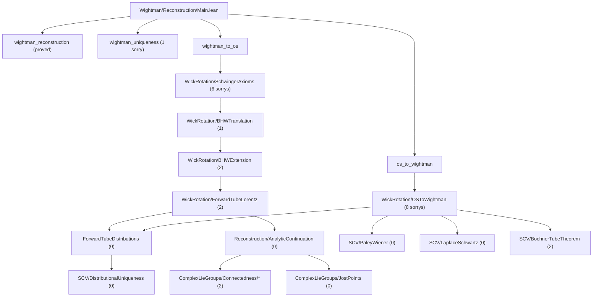

# OSReconstruction

A Lean 4 formalization of the **Osterwalder-Schrader reconstruction theorem** and supporting infrastructure in **von Neumann algebra theory**, built on [Mathlib](https://github.com/leanprover-community/mathlib4).

## Overview

This project formalizes the mathematical bridge between Euclidean and relativistic quantum field theory. The OS reconstruction theorem establishes that Schwinger functions (Euclidean correlators) satisfying certain axioms can be analytically continued to yield Wightman functions defining a relativistic QFT, and vice versa.

### Modules

- **`OSReconstruction.Wightman`** — Wightman axioms, Schwartz tensor products, Poincaré/Lorentz groups, spacetime geometry, GNS construction, analytic continuation (tube domains, Bargmann-Hall-Wightman, edge-of-the-wedge), Wick rotation, and the reconstruction theorems.

- **`OSReconstruction.vNA`** — Von Neumann algebra foundations: cyclic/separating vectors, predual theory, Tomita-Takesaki modular theory, modular automorphism groups, KMS condition, spectral theory via Riesz-Markov-Kakutani, unbounded self-adjoint operators, and Stone's theorem.

- **`OSReconstruction.SCV`** — Several complex variables infrastructure: polydiscs, iterated Cauchy integrals, Osgood's lemma, separately holomorphic implies jointly analytic (Hartogs), tube domain extension, identity theorems, distributional boundary values on tubes, Bochner tube theorem, Fourier-Laplace representation, and Paley-Wiener theorems. The boundary-value / Fourier-Laplace side is now largely sorry-free; the remaining SCV blocker is the local-to-global tube extension lane in `BochnerTubeTheorem.lean`.

- **`OSReconstruction.ComplexLieGroups`** — Complex Lie group theory for the Bargmann-Hall-Wightman theorem: GL(n;C)/SL(n;C)/SO(n;C) path-connectedness, complex Lorentz group and its path-connectedness via Wick rotation, Jost's lemma (Wick rotation maps spacelike configurations into the extended tube), and the BHW theorem structure (extended tube, complex Lorentz invariance, permutation symmetry, uniqueness).

### Dependencies

- [**gaussian-field**](https://github.com/mrdouglasny/gaussian-field) — Sorry-free Hermite function basis, Schwartz-Hermite expansion, Dynin-Mityagin and Pietsch nuclear space definitions, spectral theorem for compact self-adjoint operators, nuclear SVD, and Gaussian measure construction on weak duals.

## Building

Requires [Lean 4](https://lean-lang.org/) and [Lake](https://github.com/leanprover/lean4/tree/master/src/lake).

```bash
lake build
```

This will fetch Mathlib and all dependencies automatically. The first build may take a while.

## Entrypoints

- `import OSReconstruction` or `import OSReconstruction.OS` for the OS reconstruction critical path.
- `import OSReconstruction.All` for the full stack (OS + vNA).
- `import OSReconstruction.vNA` when working only on the von Neumann algebra development.

## Project Status

The project builds cleanly with **zero `axiom` declarations**. Remaining work is tracked via direct
`sorry` placeholders.

Priority note:
- The analyticity-critical path is `WickRotation/OSToWightman.lean` together with the SCV and Wick-rotation distributional infrastructure it depends on.
- `StoneTheorem` and the broader `vNA` operator-theoretic lane are not on that critical path. They are needed later for the GNS/operator reconstruction theorem `wightman_reconstruction`, specifically the `spectrum_condition` and `vacuum_unique` branches of `gnsQFT`.
- So, for the key OS reconstruction theorems in `Main.lean`, the immediate priorities are `wightman_to_os` and `os_to_wightman`, not Stone/self-adjoint-generator machinery.

Recent progress (2026-03-11):
- **The OS semigroup / spectral lane advanced substantially.** In `WickRotation/OSToWightman.lean`, the honest OS quotient/completion semigroup is now in place with contraction, positivity, self-adjointness, rational-time identification with functional-calculus powers, and the new positive-time continuity input from `vNA/Bochner/SemigroupRoots.lean`.
- **Generic tempered boundary-value infrastructure was extracted into production SCV code.** `SCV/LaplaceSchwartz.lean` now contains reusable lemmas for polynomial-growth integrability against Schwartz tests, dominated convergence for boundary-ray integrals, and the resulting boundary-distribution bound. These close the DCT/integrability side of `boundary_values_tempered`.
- **The live root blockers are now sharper.** On the E→R side they remain `schwinger_continuation_base_step` and `boundary_values_tempered`; on the R→E side the honest root gaps remain coincidence-singularity control and Euclidean reality/reflection.

Recent progress (2026-03-10):
- **Distributional EOW is complete.** The full chain from distributional boundary values through distributional uniqueness, distributional BHW swap equality, pointwise extraction, and connected-overlap propagation is proved with 0 sorrys. Key new files: `SCV/DistributionalUniqueness.lean` (0 sorrys), `SCV/SchwartzComplete.lean` (0 sorrys), `ComplexLieGroups/Connectedness/BHWPermutation/AdjacencyDistributional.lean` (0 sorrys).
- **BHW permutation flow rewired to distributional hypotheses.** The entire BHW permutation chain (`PermutationFlow.lean`) now runs on distributional boundary-value data instead of pointwise boundary continuity — the honest interface.
- **BHWExtension now carries only the honest theorem surface.** `W_analytic_swap_boundary_pairing_eq` and `analytic_extended_local_commutativity` are proved, and the obsolete raw-boundary placeholders have been removed. The optional raw-value bridge that remains is `analytic_boundary_local_commutativity_of_boundary_continuous`, which isolates the true extra input: boundary continuity on the real ET edge.
- **Euclidean Hermiticity is now localized to the true PET overlap problem.** `SchwingerAxioms.lean` now exposes the conjugate-reversal overlap domain and proves the reflected partner `z ↦ conj(F(conj-rev z))` is holomorphic there. The remaining gap in `bhw_euclidean_reality_ae` is exactly to prove equality of the two holomorphic functions on that overlap from `wightman_real_on_jost_support`.
- **ForwardTubeDistributions.lean** is now sorry-free (was 4 sorrys).

Snapshot (2026-03-11, counted with `rg -c '^[[:space:]]*sorry([[:space:]]|$)' OSReconstruction --glob '*.lean'`):

| Module | Direct `sorry` lines |
|--------|-----------------------|
| `Wightman/` | 30 |
| `SCV/` | 2 |
| `ComplexLieGroups/` | 2 |
| `vNA/` | 39 |
| **Total** | **73** |

### OS-Critical Sorry Flow Toward Reconstruction



### Critical-Path Blockers (File Level)

| File | Direct `sorry`s | Notes |
|------|------------------|-------|
| `Wightman/Reconstruction/Main.lean` | 1 | `wightman_uniqueness` |
| `Wightman/WightmanAxioms.lean` | 4 | nuclear extension + spectrum/BV infrastructure |
| `Wightman/NuclearSpaces/BochnerMinlos.lean` | 5 | Bochner-Minlos measure construction |
| `Wightman/NuclearSpaces/NuclearSpace.lean` | 2 | nuclear space infrastructure |
| `Wightman/Reconstruction/ForwardTubeDistributions.lean` | 0 | distributional uniqueness proved via EOW infrastructure |
| `Wightman/Reconstruction/WickRotation/ForwardTubeLorentz.lean` | 2 | poly growth slice + PET measure zero |
| `Wightman/Reconstruction/WickRotation/BHWExtension.lean` | 0 | honest extendF/distributional adjacent-swap lane complete |
| `Wightman/Reconstruction/WickRotation/BHWTranslation.lean` | 1 | PET intersection connectivity |
| `Wightman/Reconstruction/WickRotation/SchwingerAxioms.lean` | 7 | coincidence singularities, reality/reflection, cluster, OS=W term |
| `Wightman/Reconstruction/WickRotation/OSToWightman.lean` | 8 | base-step continuation, tempered BV package, transfer chain |
| `SCV/PaleyWiener.lean` | 0 | sorry-free |
| `SCV/LaplaceSchwartz.lean` | 0 | sorry-free; generic tempered boundary-value lemmas extracted |
| `SCV/TubeDistributions.lean` | 0 | sorry-free |
| `SCV/BochnerTubeTheorem.lean` | 2 | local-to-global tube extension |
| `ComplexLieGroups/Connectedness/BHWPermutation/PermutationFlowBlocker.lean` | 2 | permutation flow blockers |
| `vNA/MeasureTheory/CaratheodoryExtension.lean` | 11 | measure-theoretic extension lane |
| `vNA/KMS.lean` | 10 | KMS/modular theory lane |
| `vNA/ModularAutomorphism.lean` | 6 | modular automorphism theory |
| `vNA/ModularTheory.lean` | 6 | Tomita-Takesaki core |
| `vNA/Unbounded/StoneTheorem.lean` | 2 | Stone/self-adjoint generator lane |
| `vNA/Unbounded/Spectral.lean` | 2 | unbounded spectral theory |
| `vNA/Predual.lean` | 2 | normal functionals, σ-weak topology |

Operator-theoretic side note:
- `Main.wightman_reconstruction` is a separate GNS/operator lane.
- The `StoneTheorem` file matters there, but not for the analyticity results in `OSToWightman`.
- The minimal Stone-side targets for that lane are the generator density/self-adjointness results used to support reconstructed `spectrum_condition` and `vacuum_unique`.

See also [`docs/development_plan_systematic.md`](docs/development_plan_systematic.md), [`OSReconstruction/Wightman/TODO.md`](OSReconstruction/Wightman/TODO.md), and [`OSReconstruction/ComplexLieGroups/TODO.md`](OSReconstruction/ComplexLieGroups/TODO.md) for the synchronized execution plan.

## File Structure

```
OSReconstruction/
├── vNA/                          # Von Neumann algebra theory
│   ├── Basic.lean                # Cyclic/separating vectors, standard form
│   ├── Predual.lean              # Normal functionals, σ-weak topology
│   ├── Antilinear.lean           # Antilinear operator infrastructure
│   ├── ModularTheory.lean        # Tomita-Takesaki: S, Δ, J
│   ├── ModularAutomorphism.lean  # σ_t, Connes cocycle
│   ├── KMS.lean                  # KMS condition
│   ├── Spectral/                 # Spectral theory via RMK (active work)
│   ├── Unbounded/                # Unbounded operators, spectral theorem, Stone
│   ├── MeasureTheory/            # Spectral integrals, Stieltjes, Carathéodory
│   └── Bochner/                  # Operator Bochner integrals
├── Wightman/                     # Wightman QFT
│   ├── Basic.lean                # Core definitions
│   ├── WightmanAxioms.lean       # Axiom formalization
│   ├── OperatorDistribution.lean # Operator-valued distributions
│   ├── SchwartzTensorProduct.lean# Schwartz space tensor products
│   ├── ReconstructionBridge.lean # Wires WickRotation to top-level theorems
│   ├── Groups/                   # Lorentz and Poincaré groups
│   ├── Spacetime/                # Minkowski geometry
│   ├── NuclearSpaces/            # Nuclear spaces, gaussian-field bridge
│   ├── SCV/                      # SCV helpers (bridges to top-level SCV/)
│   └── Reconstruction/           # The reconstruction theorems
│       ├── GNSConstruction.lean  # GNS construction (sorry-free)
│       ├── GNSHilbertSpace.lean  # GNS Hilbert space + Poincaré rep
│       ├── AnalyticContinuation.lean  # Tube domains, BHW, edge-of-wedge
│       ├── ForwardTubeDistributions.lean  # Forward tube boundary values
│       ├── PoincareAction.lean   # Poincaré action on Schwartz space (sorry-free)
│       ├── PoincareRep.lean      # n-point Poincaré representations (sorry-free)
│       ├── WickRotation.lean     # OS ↔ Wightman bridge (barrel file)
│       ├── WickRotation/         # WickRotation submodules
│       │   ├── ForwardTubeLorentz.lean   # Forward tube Lorentz invariance
│       │   ├── BHWExtension.lean         # BHW extension definition
│       │   ├── BHWTranslation.lean       # Translation invariance
│       │   ├── SchwingerAxioms.lean      # E0-E4 axiom proofs
│       │   └── OSToWightman.lean         # E'→R' + bridge theorems
│       ├── Main.lean             # Top-level theorem wiring
│       └── Helpers/              # EdgeOfWedge, SeparatelyAnalytic
├── SCV/                          # Several complex variables
│   ├── Polydisc.lean             # Polydisc definitions and properties
│   ├── IteratedCauchyIntegral.lean  # Multi-variable Cauchy integrals
│   ├── Osgood.lean               # Osgood's lemma
│   ├── Analyticity.lean          # Hartogs: separately → jointly analytic
│   ├── TubeDomainExtension.lean  # Tube domain extension theorems
│   ├── IdentityTheorem.lean      # Identity theorems (product types, totally real)
│   ├── TotallyRealIdentity.lean  # Identity theorem on totally real submanifolds
│   ├── EOWMultiDim.lean          # Multi-dimensional edge-of-the-wedge helpers
│   ├── MoebiusMap.lean           # Möbius transformations for conformal maps
│   ├── TubeDistributions.lean    # Distributional boundary values on tubes
│   ├── DistributionalUniqueness.lean  # Distributional EOW: tube uniqueness from BV=0
│   ├── SchwartzComplete.lean     # Schwartz completeness + barrelledness
│   ├── BochnerTubeTheorem.lean   # Bochner tube theorem
│   ├── LaplaceSchwartz.lean      # Fourier-Laplace representation
│   └── PaleyWiener.lean          # Paley-Wiener theorems
├── ComplexLieGroups/              # Complex Lie groups for BHW theorem
│   ├── MatrixLieGroup.lean       # GL(n;C), SL(n;C) path-connectedness
│   ├── SOConnected.lean          # SO(n;C) path-connectedness
│   ├── Complexification.lean     # Complex Lorentz group SO+(1,d;C)
│   ├── LorentzLieGroup.lean      # Real Lorentz group infrastructure
│   ├── JostPoints.lean           # Jost's lemma, Wick rotation, extendF
│   └── Connectedness/            # BHW connectedness/permutation submodules
└── Reconstruction.lean           # Top-level reconstruction theorems
```

## References

- Osterwalder-Schrader, "Axioms for Euclidean Green's Functions" I & II (1973, 1975)
- Streater-Wightman, "PCT, Spin and Statistics, and All That"
- Glimm-Jaffe, "Quantum Physics: A Functional Integral Point of View"
- Reed-Simon, "Methods of Modern Mathematical Physics" I
- Takesaki, "Theory of Operator Algebras" I, II, III

## License

This project is licensed under the Apache License 2.0 — see [LICENSE](LICENSE) for details.
