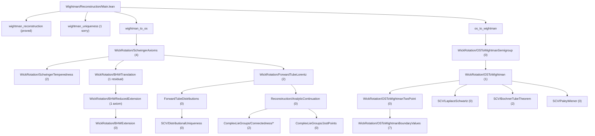

# OSReconstruction

## Route 1 Translation Invariance Status (2026-03-16)

**Date**: 2026-03-16

The Route 1 refactor proves `bhw_translation_invariant` (BHW extension is
translation-invariant on the permuted extended tube) via reduced difference
coordinates and the Identity Theorem, replacing the logically false D(c)
overlap-connectivity approach.

| Metric | Count |
|--------|-------|
| `bhw_translation_invariant` sorry | **0** (proved) |
| Route 1 axioms remaining | **1** (`reduced_bargmann_hall_wightman_of_input`) |
| Axioms eliminated this session | 3 (`integral_realDiffCoord_change_variables`, `realDiffCoordCLE_symm_measurePreserving`, `schwartzTranslationClassification`) |
| Old-route residual sorry in `BHWTranslation` | 1 (`isPreconnected_baseFiber`) |

The sole remaining axiom is the **reduced BHW theorem** — the Bargmann-Hall-Wightman
envelope of holomorphy executed natively in (n-1) reduced difference coordinates.
This requires porting the permutation flow (Edge of the Wedge + Lorentz sweeping)
to the quotient geometry. See [`docs/ROUTE1_AXIOM_STATUS.md`](docs/ROUTE1_AXIOM_STATUS.md)
for the Route 1 status note and
[`docs/reduced_bhw_bridge_and_numerics.md`](docs/reduced_bhw_bridge_and_numerics.md)
for the intended absolute-to-reduced bridge and numerical diagnostics.

The pre-existing `isPreconnected_baseFiber` sorry in `BHWTranslation.lean`
remains in the tree as an old-route residual theorem, but it is no longer
needed to prove `bhw_translation_invariant` on the merged `R -> E` path.

---

A Lean 4 formalization of the **Osterwalder-Schrader reconstruction theorem** and supporting infrastructure in **von Neumann algebra theory**, built on [Mathlib](https://github.com/leanprover-community/mathlib4).

## Overview

This project formalizes the mathematical bridge between Euclidean and relativistic quantum field theory. The OS reconstruction theorem establishes that Schwinger functions (Euclidean correlators) satisfying certain axioms can be analytically continued to yield Wightman functions defining a relativistic QFT, and vice versa.

In the current formalization, the theorem surfaces are the corrected ones:
- `R -> E` lands on the honest zero-diagonal Euclidean Schwinger side, not an a priori full-Schwartz Euclidean extension.
- `E -> R` uses the corrected OS-II input, namely the OS axioms together with the explicit linear-growth condition.

### Modules

- **`OSReconstruction.Wightman`** — Wightman axioms, Schwartz tensor products, Poincaré/Lorentz groups, spacetime geometry, GNS construction, analytic continuation (tube domains, Bargmann-Hall-Wightman, edge-of-the-wedge), Wick rotation, and the reconstruction theorems.

- **`OSReconstruction.vNA`** — Von Neumann algebra foundations: cyclic/separating vectors, predual theory, Tomita-Takesaki modular theory, modular automorphism groups, KMS condition, spectral theory via Riesz-Markov-Kakutani, unbounded self-adjoint operators, and Stone's theorem.

- **`OSReconstruction.SCV`** — Several complex variables infrastructure: polydiscs, iterated Cauchy integrals, Osgood's lemma, separately holomorphic implies jointly analytic (Hartogs), tube domain extension, identity theorems, distributional boundary values on tubes, Bochner tube theorem, Fourier-Laplace representation, and Paley-Wiener theorems. The boundary-value / Fourier-Laplace side is now largely sorry-free; the remaining SCV blocker is the local-to-global tube extension lane in `BochnerTubeTheorem.lean`.

- **`OSReconstruction.ComplexLieGroups`** — Complex Lie group theory for the Bargmann-Hall-Wightman theorem: GL(n;C)/SL(n;C)/SO(n;C) path-connectedness, complex Lorentz group and its path-connectedness via Wick rotation, Jost's lemma (Wick rotation maps spacelike configurations into the extended tube), and the BHW theorem structure (extended tube, complex Lorentz invariance, permutation symmetry, uniqueness).

### Dependencies

- [**gaussian-field**](https://github.com/mrdouglasny/gaussian-field) — Sorry-free Hermite function basis, Schwartz-Hermite expansion, Dynin-Mityagin and Pietsch nuclear space definitions, spectral theorem for compact self-adjoint operators, nuclear SVD, and Gaussian measure construction on weak duals.

## Building

Requires [Lean 4](https://lean-lang.org/) and [Lake](https://github.com/leanprover/lean4/tree/master/src/lake).

```bash
lake build
```

For targeted verification, the most useful entry build is usually:

```bash
lake build OSReconstruction.Wightman.Reconstruction.Main
```

This fetches Mathlib and dependencies automatically on first build.

## Entrypoints

- `import OSReconstruction` or `import OSReconstruction.OS`
  OS-critical umbrella: the Wightman/SCV/Complex-Lie-group reconstruction stack,
  excluding the broader `vNA` lane.
- `import OSReconstruction.All`
  Full umbrella: OS-critical path plus the `vNA` development.
- `import OSReconstruction.Wightman.Reconstruction.Main`
  Top-level theorem wiring for `wightman_reconstruction`, `wightman_to_os`,
  and `os_to_wightman`.
- `import OSReconstruction.Wightman.Reconstruction.WickRotation`
  Barrel for the Wick-rotation bridge files.
- `import OSReconstruction.vNA`
  Operator-theoretic lane only.

## Project Status

The tracked production tree currently includes **one explicit `axiom`
declaration** on the Route 1 translation-invariance lane:
`reduced_bargmann_hall_wightman_of_input`.
Remaining work outside that deferred bridge is represented by explicit
theorem-level `sorry` placeholders.
The snapshot below counts only tracked production files; local scratch under
`Proofideas/` and other untracked experiments are intentionally excluded.

Current blocker map:
- The analyticity-critical `E -> R` path is the split
  `WickRotation/OSToWightmanSemigroup.lean` ->
  `WickRotation/OSToWightman.lean` ->
  `WickRotation/OSToWightmanTwoPoint.lean` ->
  `WickRotation/OSToWightmanBoundaryValues.lean`.
- The zero-diagonal `R -> E` temperedness front has been split out of the old
  `SchwingerAxioms.lean` monolith into
  `WickRotation/SchwingerTemperedness.lean`, so the live E0 `sorry`s now sit in
  a small dedicated file rather than in a >3000-line axiom file.
- Route 1 translation invariance is now merged in production:
  `bhw_translation_invariant` is proved in `WickRotation/BHWTranslation.lean`,
  backed by one deferred reduced-BHW bridge axiom in
  `WickRotation/BHWReducedExtension.lean`.
- The same cleanup has been applied on the `vNA` side: the open positive-power /
  unitary-group lane has been split from `vNA/Unbounded/Spectral.lean` into
  `vNA/Unbounded/SpectralPowers.lean`, leaving the core spectral-construction
  file sorry-free on the moved tail.
- `OSToWightmanSemigroup.lean` is the established OS semigroup/spectral/Laplace
  and one-variable holomorphic layer.
- The live root `E -> R` blocker is
  `schwinger_continuation_base_step` in `OSToWightman.lean`:
  constructing the OS-II-faithful time-parametric witness from the interleaved
  OS slice data.
- The public theorem surface has been corrected: `schwinger_continuation_base_step`
  now exposes the weaker OS-II base step directly, with time-difference
  holomorphicity and spatial variables treated as parameters. The old full
  `ACR(1)` holomorphic surface survives only as an internal legacy upgrade used
  by the current downstream restriction chain.
- The older time-only two-point witness lane has been removed from the active
  `OSToWightman.lean` blocker surface. It was a dead auxiliary route and not the
  mathematically relevant `k = 2` witness.
- `OSToWightmanTwoPoint.lean` now carries the specialized `k = 2`
  center/difference spectral and holomorphic reduction ladder, so the core
  `OSToWightman.lean` file stays focused on the base-step analytic machinery.
- The current working route for that blocker is now closer to the OS-II shape:
  first reduce by center-spatial descent, then by the active center-time
  variable. The key infrastructure for that reduction lives in
  `Wightman/Reconstruction/CenterSpatialTranslationInvariant.lean`,
  together with the older one-variable descent files
  `TranslationInvariantSchwartz.lean` and `HeadTranslationInvariant.lean`.
- On the `k = 2` front, the honest remaining gap is no longer generic
  translation algebra. The live seam is:
  construct the fixed-time reduced semigroup functional on
  `SchwartzMap (Fin (d + 1) → ℝ) ℂ`, compare it on a dense set with the
  corresponding concrete kernel CLM, and then lift that equality back through
  the center-spatial and head-time descent theorems in
  `CenterSpatialTranslationInvariant.lean` and
  `HeadTranslationInvariant.lean`.
- The older time-only two-point witness is now treated only as an auxiliary
  one-variable object. It is not the intended final `k = 2` witness, because
  the final witness must see the full difference variable, including spatial
  difference coordinates.
- The translation-invariant Schwartz classification lane is now in production in
  `Wightman/Reconstruction/TranslationInvariantSchwartz.lean`, and the two-point
  Schwinger/Wightman center-difference reductions are correspondingly
  unconditional.
- Compact-support Schwartz density and the compact-product Stone-Weierstrass
  core are now in production, so the remaining dense-agreement work is no
  longer generic cutoff infrastructure. What is still missing is the final
  blocker-facing assembly on the reduced quotient used by the corrected
  two-point semigroup witness route.
- The next `E -> R` blocker after that is `boundary_values_tempered` and the
  transfer chain in `OSToWightmanBoundaryValues.lean`, where the genuine growth
  inputs must come from `OSLinearGrowthCondition`.
- On the merged `R -> E` path, the theorem-level front blockers have moved
  downstream past `BHWTranslation.lean`. The live front is now the
  zero-diagonal integrability / continuity pair in
  `SchwingerTemperedness.lean`.
- After that, the remaining theorem-level `R -> E` blockers are the analytic
  ones in `SchwingerAxioms.lean`, especially the OS=W term, Euclidean
  reality/reflection, and the cluster bridge.
- `isPreconnected_baseFiber` remains in `WickRotation/BHWTranslation.lean` as
  an old-route residual theorem, but it is no longer the blocker used to obtain
  `bhw_translation_invariant` on the merged path.
- `ForwardTubeLorentz.lean` still carries the two upstream analytic-geometry
  `sorry`s needed by the BHW/Wick-rotation lane.
- `StoneTheorem` and the broader `vNA` operator lane matter for the separate
  GNS/operator reconstruction theorem `wightman_reconstruction`, but not for the
  current Wick-rotation critical path.

### Current Operational Blockers

- `E -> R`:
  the near-term goal is to close the specialized `k = 2` case of
  `schwinger_continuation_base_step` by building the corrected reduced
  semigroup functional on the final difference-variable quotient and proving
  dense agreement with the concrete kernel CLM there.
- `E -> R` downstream:
  even after that base-step closes, `OSToWightmanBoundaryValues.lean` still
  carries the tempered boundary-value and transfer chain.
- `R -> E`:
  the front blocker is the base-fiber connectivity theorem in
  `BHWTranslation.lean`; it is geometric, not just local algebra.
- `R -> E` downstream:
  `SchwingerAxioms.lean` still contains the remaining analytic Wick-rotation
  obligations after the BHW geometry is available.

Snapshot (2026-03-16, tracked production tree):

| Module | Direct `sorry` lines |
|--------|-----------------------|
| `Wightman/` | 33 |
| `SCV/` | 2 |
| `ComplexLieGroups/` | 2 |
| `vNA/` | 40 |
| **Total** | **77** |

Tracked production tree also contains `1` explicit axiom:
`reduced_bargmann_hall_wightman_of_input`.

### OS-Critical Sorry Flow Toward Reconstruction



### Critical-Path Blockers (File Level)

| File | Direct `sorry`s | Notes |
|------|------------------|-------|
| `Wightman/Reconstruction/Main.lean` | 1 | `wightman_uniqueness` |
| `Wightman/WightmanAxioms.lean` | 4 | nuclear extension + spectrum/BV infrastructure |
| `Wightman/NuclearSpaces/BochnerMinlos.lean` | 5 | Bochner-Minlos measure construction |
| `Wightman/NuclearSpaces/NuclearSpace.lean` | 2 | nuclear space infrastructure |
| `Wightman/Reconstruction/ForwardTubeDistributions.lean` | 0 | distributional uniqueness / boundary-value lane complete |
| `Wightman/Reconstruction/WickRotation/ForwardTubeLorentz.lean` | 2 | polynomial growth slice + PET measure-zero step |
| `Wightman/Reconstruction/WickRotation/BHWExtension.lean` | 0 | honest distributional adjacent-swap lane complete |
| `Wightman/Reconstruction/WickRotation/BHWTranslation.lean` | 1 | old-route base-fiber residual; merged path uses Route 1 reduced coordinates |
| `Wightman/Reconstruction/WickRotation/BHWReducedExtension.lean` | 0 + 1 axiom | deferred reduced BHW bridge theorem |
| `Wightman/Reconstruction/WickRotation/SchwingerTemperedness.lean` | 2 | zero-diagonal integrability / continuity front |
| `Wightman/Reconstruction/WickRotation/SchwingerAxioms.lean` | 4 | OS=W term, reality/reflection, cluster |
| `Wightman/Reconstruction/WickRotation/OSToWightmanSemigroup.lean` | 0 | OS semigroup, spectral/Laplace bridge, one-variable holomorphic infrastructure |
| `Wightman/Reconstruction/WickRotation/OSToWightman.lean` | 2 | time-parametric base step + legacy spatial upgrade |
| `Wightman/Reconstruction/WickRotation/OSToWightmanTwoPoint.lean` | 0 | specialized `k = 2` spectral / holomorphic reduction ladder |
| `Wightman/Reconstruction/WickRotation/OSToWightmanBoundaryValues.lean` | 7 | tempered boundary values, transfer chain, cluster |
| `SCV/LaplaceSchwartz.lean` | 0 | generic tempered boundary-value lemmas extracted |
| `SCV/TubeDistributions.lean` | 0 | sorry-free |
| `SCV/BochnerTubeTheorem.lean` | 2 | local-to-global tube extension |
| `SCV/PaleyWiener.lean` | 0 | sorry-free |
| `ComplexLieGroups/Connectedness/BHWPermutation/PermutationFlowBlocker.lean` | 2 | permutation-flow blockers |
| `vNA/MeasureTheory/CaratheodoryExtension.lean` | 11 | measure-theoretic extension lane |
| `vNA/KMS.lean` | 10 | KMS/modular theory lane |
| `vNA/ModularAutomorphism.lean` | 6 | modular automorphism theory |
| `vNA/ModularTheory.lean` | 6 | Tomita-Takesaki core |
| `vNA/Unbounded/StoneTheorem.lean` | 2 | Stone/self-adjoint generator lane |
| `vNA/Unbounded/SpectralPowers.lean` | 2 | positive powers / unitary-group lane |
| `vNA/Predual.lean` | 2 | normal functionals, sigma-weak topology |

Operator-theoretic side note:
- `Main.wightman_reconstruction` is a separate GNS/operator lane.
- The `StoneTheorem` file matters there, but not for the analyticity results in
  the `OSToWightman*` stack.
- The minimal Stone-side targets for that lane are the generator
  density/self-adjointness results feeding reconstructed `spectrum_condition`
  and `vacuum_unique`.

See also [`docs/development_plan_systematic.md`](docs/development_plan_systematic.md),
[`OSReconstruction/Wightman/TODO.md`](OSReconstruction/Wightman/TODO.md), and
[`OSReconstruction/ComplexLieGroups/TODO.md`](OSReconstruction/ComplexLieGroups/TODO.md)
for the synchronized execution plan.

## Repository Layout

The repository now has a clear barrel/module split at the top level. The layout
below is selective rather than exhaustive; it is meant as a navigation map for
the tracked production tree, not as a complete file listing.

```
.
├── OSReconstruction.lean                 # default umbrella = OS critical path
├── OSReconstruction/
│   ├── OS.lean                           # OS-critical umbrella (no vNA)
│   ├── All.lean                          # full umbrella (OS + vNA)
│   ├── Wightman.lean                     # Wightman/reconstruction umbrella
│   ├── SCV.lean                          # SCV umbrella
│   ├── ComplexLieGroups.lean             # BHW/Lorentz umbrella
│   ├── vNA.lean                          # vNA umbrella
│   ├── Bridge.lean                       # barrel for axiom-replacement bridge
│   ├── Bridge/
│   │   └── AxiomBridge.lean              # type/axiom bridges between SCV, BHW, Wightman
│   ├── Wightman/
│   │   ├── Basic.lean                    # core Wightman-side definitions
│   │   ├── WightmanAxioms.lean           # Wightman function axioms and extension surfaces
│   │   ├── OperatorDistribution.lean     # operator-valued distributions
│   │   ├── SchwartzTensorProduct.lean    # Schwartz tensor products and insertion CLMs
│   │   ├── Reconstruction.lean           # stable reconstruction barrel
│   │   ├── ReconstructionBridge.lean     # wires WickRotation to theorem surface
│   │   ├── Groups/                       # Lorentz and Poincare groups
│   │   ├── Spacetime/                    # Minkowski geometry and metric
│   │   ├── NuclearSpaces/                # nuclear-space, Minlos, and gaussian-field bridge
│   │   └── Reconstruction/
│   │       ├── Core.lean                 # shared core OS/Wightman reconstruction objects
│   │       ├── SchwingerOS.lean          # Schwinger-side / zero-diagonal OS layer
│   │       ├── Poincare1D.lean           # 1D Schwartz Poincare lemma
│   │       ├── SliceIntegral.lean        # Schwartz slice-integral infrastructure
│   │       ├── BlockIntegral.lean        # finite-block flattening and iterated slice integration
│   │       ├── ZeroMeanFourierTransport.lean # zero-mean transport infrastructure
│   │       ├── TranslationInvariantSchwartz.lean # zero-mean decomposition + translation classification
│   │       ├── HeadTranslationInvariant.lean # one active-variable factorization through sliceIntegral
│   │       ├── HeadBlockTranslationInvariant.lean # block factorization through integrateHeadBlock
│   │       ├── CenterSpatialTranslationInvariant.lean # center-spatial descent to reduced (u_time, ξ)
│   │       ├── TwoPointDescent.lean      # center/difference descent for two-point Schwartz tests
│   │       ├── WightmanTwoPoint.lean     # two-point Wightman center/difference reduction
│   │       ├── GNSConstruction.lean      # GNS construction
│   │       ├── GNSHilbertSpace.lean      # reconstructed Hilbert space and field action
│   │       ├── PoincareAction.lean       # Poincare action on test-function sequences
│   │       ├── PoincareRep.lean          # n-point Poincare representations
│   │       ├── AnalyticContinuation.lean # forward tube, BHW, EOW abstract surface
│   │       ├── ForwardTubeDistributions.lean # distributional forward-tube boundary values
│   │       ├── Main.lean                 # top-level theorem wiring
│   │       ├── Helpers/                  # auxiliary separately-analytic / EOW helpers
│   │       └── WickRotation/
│   │           ├── ForwardTubeLorentz.lean      # Lorentz covariance on the tube
│   │           ├── BaseFiberInflation.lean      # forward-tube/Lorentz inflation helpers
│   │           ├── BHWExtension.lean            # BHW extension / adjacent-swap layer
│   │           ├── BHWTranslation.lean          # translation-invariance transfer
│   │           ├── HermitianBoundaryPairing.lean # rapidity-reduced partner BV pairing
│   │           ├── SchwingerAxioms.lean         # R -> E Wick-rotation axioms
│   │           ├── OSToWightmanSemigroup.lean   # OS semigroup, spectral/Laplace, 1-variable holomorphy
│   │           ├── OSToWightman.lean            # flat-witness continuation core
│   │           ├── OSToWightmanTwoPoint.lean    # specialized two-point reduction ladder
│   │           ├── WickRotationBridge.lean      # small Wick-rotation differentiability helpers
│   │           └── OSToWightmanBoundaryValues.lean # tempered BV package and axiom transfer
│   ├── SCV/
│   │   ├── Polydisc.lean                 # polydisc geometry
│   │   ├── IteratedCauchyIntegral.lean   # multivariable Cauchy integrals
│   │   ├── Osgood.lean                   # Osgood's lemma
│   │   ├── SeparatelyAnalytic.lean       # separate -> joint analytic infrastructure
│   │   ├── EdgeOfWedge.lean              # 1D EOW infrastructure
│   │   ├── EOWMultiDim.lean              # multidimensional EOW helpers
│   │   ├── TubeDomainExtension.lean      # tube-domain extension results
│   │   ├── TubeDistributions.lean        # distributional boundary values on tubes
│   │   ├── DistributionalUniqueness.lean # tube uniqueness from zero boundary value
│   │   ├── TotallyRealIdentity.lean      # totally-real identity / Schwarz-reflection tools
│   │   ├── LaplaceHolomorphic.lean       # half-plane Laplace holomorphy
│   │   ├── LaplaceSchwartz.lean          # tempered boundary-value/Fourier-Laplace package
│   │   ├── BochnerTubeTheorem.lean       # Bochner tube theorem
│   │   └── PaleyWiener.lean              # Paley-Wiener infrastructure
│   ├── ComplexLieGroups/
│   │   ├── MatrixLieGroup.lean           # GL/SL connectedness
│   │   ├── LorentzLieGroup.lean          # real Lorentz-group infrastructure
│   │   ├── Complexification.lean         # complex Lorentz group
│   │   ├── JostPoints.lean               # Jost-point geometry / Wick rotation
│   │   └── Connectedness/                # BHW connectedness and permutation flow
│   └── vNA/
│       ├── Basic.lean                    # basic vNA infrastructure
│       ├── Predual.lean                  # normal functionals and sigma-weak topology
│       ├── Antilinear.lean               # antilinear operators
│       ├── ModularTheory.lean            # Tomita-Takesaki core
│       ├── ModularAutomorphism.lean      # modular automorphism group
│       ├── KMS.lean                      # KMS condition
│       ├── Bochner/                      # bounded functional calculus / operator Bochner layer
│       ├── Spectral/                     # bounded spectral-theorem via RMK lane
│       ├── Unbounded/                    # unbounded operators, spectral theorem, Stone
│       └── MeasureTheory/                # spectral integrals, Stieltjes, Caratheodory
└── docs/                                 # synchronized development plans
```

Two navigation notes:
- `Wightman/Reconstruction.lean` is now the stable reconstruction barrel. The
  shared core definitions live in `Wightman/Reconstruction/Core.lean`, and the
  Schwinger/OS-side reduction layer lives in
  `Wightman/Reconstruction/SchwingerOS.lean`. The new finite-block descent
  helpers are split out into `BlockIntegral.lean`, `HeadBlockTranslationInvariant.lean`,
  `CenterSpatialTranslationInvariant.lean`, and `TwoPointDescent.lean` so the
  Wick-rotation files do not keep absorbing low-level coordinate bookkeeping.
- `Wightman/Reconstruction/Main.lean` only wires the top-level theorems.
- The old monolithic `OSToWightman` layer no longer exists as a single file.
  The live `E -> R` lane is intentionally split across
  `OSToWightmanSemigroup.lean`, `OSToWightman.lean`,
  `OSToWightmanTwoPoint.lean`, and `OSToWightmanBoundaryValues.lean`.

## References

- Osterwalder-Schrader, "Axioms for Euclidean Green's Functions" I & II (1973, 1975)
- Streater-Wightman, "PCT, Spin and Statistics, and All That"
- Glimm-Jaffe, "Quantum Physics: A Functional Integral Point of View"
- Reed-Simon, "Methods of Modern Mathematical Physics" I
- Takesaki, "Theory of Operator Algebras" I, II, III

## License

This project is licensed under the Apache License 2.0 — see [LICENSE](LICENSE) for details.
