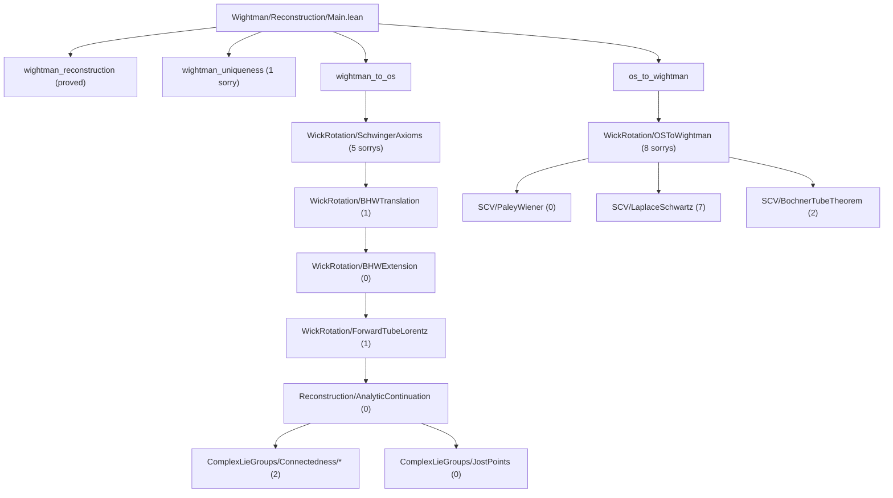

# OSReconstruction

A Lean 4 formalization of the **Osterwalder-Schrader reconstruction theorem** and supporting infrastructure in **von Neumann algebra theory**, built on [Mathlib](https://github.com/leanprover-community/mathlib4).

## Overview

This project formalizes the mathematical bridge between Euclidean and relativistic quantum field theory. The OS reconstruction theorem establishes that Schwinger functions (Euclidean correlators) satisfying certain axioms can be analytically continued to yield Wightman functions defining a relativistic QFT, and vice versa.

### Modules

- **`OSReconstruction.Wightman`** — Wightman axioms, Schwartz tensor products, Poincaré/Lorentz groups, spacetime geometry, GNS construction, analytic continuation (tube domains, Bargmann-Hall-Wightman, edge-of-the-wedge), Wick rotation, and the reconstruction theorems.

- **`OSReconstruction.vNA`** — Von Neumann algebra foundations: cyclic/separating vectors, predual theory, Tomita-Takesaki modular theory, modular automorphism groups, KMS condition, spectral theory via Riesz-Markov-Kakutani, unbounded self-adjoint operators, and Stone's theorem.

- **`OSReconstruction.SCV`** — Several complex variables infrastructure: polydiscs, iterated Cauchy integrals, Osgood's lemma, separately holomorphic implies jointly analytic (Hartogs), tube domain extension, identity theorems, distributional boundary values on tubes, Bochner tube theorem, Fourier-Laplace representation, and Paley-Wiener theorems. Core files (Polydisc through IdentityTheorem) are sorry-free; newer distribution theory files have sorrys at deep analytic steps.

- **`OSReconstruction.ComplexLieGroups`** — Complex Lie group theory for the Bargmann-Hall-Wightman theorem: GL(n;C)/SL(n;C)/SO(n;C) path-connectedness, complex Lorentz group and its path-connectedness via Wick rotation, Jost's lemma (Wick rotation maps spacelike configurations into the extended tube), and the BHW theorem structure (extended tube, complex Lorentz invariance, permutation symmetry, uniqueness).

### Dependencies

- [**gaussian-field**](https://github.com/mrdouglasny/gaussian-field) — Sorry-free Hermite function basis, Schwartz-Hermite expansion, Dynin-Mityagin and Pietsch nuclear space definitions, spectral theorem for compact self-adjoint operators, nuclear SVD, and Gaussian measure construction on weak duals.

## Building

Requires [Lean 4](https://lean-lang.org/) and [Lake](https://github.com/leanprover/lean4/tree/master/src/lake).

```bash
lake build
```

This will fetch Mathlib and all dependencies automatically. The first build may take a while.

## Entrypoints

- `import OSReconstruction` or `import OSReconstruction.OS` for the OS reconstruction critical path.
- `import OSReconstruction.All` for the full stack (OS + vNA).
- `import OSReconstruction.vNA` when working only on the von Neumann algebra development.

## Project Status

The project builds cleanly with **zero `axiom` declarations**. Remaining work is tracked via direct
`sorry` placeholders.

Snapshot (2026-03-07, counted with `rg -c '^\s*sorry\b' OSReconstruction --glob '*.lean'`):

| Module | Direct `sorry` lines |
|--------|-----------------------|
| `Wightman/` | 30 |
| `SCV/` | 11 |
| `ComplexLieGroups/` | 2 |
| `vNA/` | 40 |
| **Total** | **83** |

### OS-Critical Sorry Flow Toward Reconstruction



### Critical-Path Blockers (File Level)

| File | Direct `sorry`s | Notes |
|------|------------------|-------|
| `Wightman/Reconstruction/Main.lean` | 1 | `wightman_uniqueness` |
| `Wightman/Reconstruction/GNSHilbertSpace.lean` | 1 | `vacuum_unique` spectral-theory branch |
| `Wightman/WightmanAxioms.lean` | 4 | nuclear extension + spectrum/BV infrastructure |
| `Wightman/Reconstruction/WickRotation/ForwardTubeLorentz.lean` | 1 | growth / BV covariance plumbing |
| `Wightman/Reconstruction/WickRotation/BHWExtension.lean` | 0 | completed |
| `Wightman/Reconstruction/WickRotation/BHWTranslation.lean` | 1 | overlap-connectivity / translation geometry |
| `Wightman/Reconstruction/WickRotation/SchwingerAxioms.lean` | 5 | E0/E2/E4 hard analytic steps |
| `Wightman/Reconstruction/WickRotation/OSToWightman.lean` | 8 | base-step continuation + BV transfer chain |
| `SCV/PaleyWiener.lean` | 0 | sorry-free as of 2026-03-07 |
| `SCV/LaplaceSchwartz.lean` | 7 | boundary growth/continuity/convergence |
| `SCV/BochnerTubeTheorem.lean` | 2 | local-to-global tube extension |
| `ComplexLieGroups/Connectedness/ComplexInvariance/Core.lean` | 1 | orbit-set preconnectedness (`hjoin` branch) |
| `ComplexLieGroups/Connectedness/BHWPermutation/PermutationFlow.lean` | 1 | permutation overlap extension (`hExtPerm` branch) |

See also [`docs/development_plan_systematic.md`](docs/development_plan_systematic.md), [`OSReconstruction/Wightman/TODO.md`](OSReconstruction/Wightman/TODO.md), and [`OSReconstruction/ComplexLieGroups/TODO.md`](OSReconstruction/ComplexLieGroups/TODO.md) for the synchronized execution plan.

## File Structure

```
OSReconstruction/
├── vNA/                          # Von Neumann algebra theory
│   ├── Basic.lean                # Cyclic/separating vectors, standard form
│   ├── Predual.lean              # Normal functionals, σ-weak topology
│   ├── Antilinear.lean           # Antilinear operator infrastructure
│   ├── ModularTheory.lean        # Tomita-Takesaki: S, Δ, J
│   ├── ModularAutomorphism.lean  # σ_t, Connes cocycle
│   ├── KMS.lean                  # KMS condition
│   ├── Spectral/                 # Spectral theory via RMK (active work)
│   ├── Unbounded/                # Unbounded operators, spectral theorem, Stone
│   ├── MeasureTheory/            # Spectral integrals, Stieltjes, Carathéodory
│   └── Bochner/                  # Operator Bochner integrals
├── Wightman/                     # Wightman QFT
│   ├── Basic.lean                # Core definitions
│   ├── WightmanAxioms.lean       # Axiom formalization
│   ├── OperatorDistribution.lean # Operator-valued distributions
│   ├── SchwartzTensorProduct.lean# Schwartz space tensor products
│   ├── ReconstructionBridge.lean # Wires WickRotation to top-level theorems
│   ├── Groups/                   # Lorentz and Poincaré groups
│   ├── Spacetime/                # Minkowski geometry
│   ├── NuclearSpaces/            # Nuclear spaces, gaussian-field bridge
│   ├── SCV/                      # SCV helpers (bridges to top-level SCV/)
│   └── Reconstruction/           # The reconstruction theorems
│       ├── GNSConstruction.lean  # GNS construction (sorry-free)
│       ├── GNSHilbertSpace.lean  # GNS Hilbert space + Poincaré rep
│       ├── AnalyticContinuation.lean  # Tube domains, BHW, edge-of-wedge
│       ├── ForwardTubeDistributions.lean  # Forward tube boundary values
│       ├── PoincareAction.lean   # Poincaré action on Schwartz space (sorry-free)
│       ├── PoincareRep.lean      # n-point Poincaré representations (sorry-free)
│       ├── WickRotation.lean     # OS ↔ Wightman bridge (barrel file)
│       ├── WickRotation/         # WickRotation submodules
│       │   ├── ForwardTubeLorentz.lean   # Forward tube Lorentz invariance
│       │   ├── BHWExtension.lean         # BHW extension definition
│       │   ├── BHWTranslation.lean       # Translation invariance
│       │   ├── SchwingerAxioms.lean      # E0-E4 axiom proofs
│       │   └── OSToWightman.lean         # E'→R' + bridge theorems
│       ├── Main.lean             # Top-level theorem wiring
│       └── Helpers/              # EdgeOfWedge, SeparatelyAnalytic
├── SCV/                          # Several complex variables
│   ├── Polydisc.lean             # Polydisc definitions and properties
│   ├── IteratedCauchyIntegral.lean  # Multi-variable Cauchy integrals
│   ├── Osgood.lean               # Osgood's lemma
│   ├── Analyticity.lean          # Hartogs: separately → jointly analytic
│   ├── TubeDomainExtension.lean  # Tube domain extension theorems
│   ├── IdentityTheorem.lean      # Identity theorems (product types, totally real)
│   ├── TotallyRealIdentity.lean  # Identity theorem on totally real submanifolds
│   ├── EOWMultiDim.lean          # Multi-dimensional edge-of-the-wedge helpers
│   ├── MoebiusMap.lean           # Möbius transformations for conformal maps
│   ├── TubeDistributions.lean    # Distributional boundary values on tubes
│   ├── BochnerTubeTheorem.lean   # Bochner tube theorem
│   ├── LaplaceSchwartz.lean      # Fourier-Laplace representation
│   └── PaleyWiener.lean          # Paley-Wiener theorems
├── ComplexLieGroups/              # Complex Lie groups for BHW theorem
│   ├── MatrixLieGroup.lean       # GL(n;C), SL(n;C) path-connectedness
│   ├── SOConnected.lean          # SO(n;C) path-connectedness
│   ├── Complexification.lean     # Complex Lorentz group SO+(1,d;C)
│   ├── LorentzLieGroup.lean      # Real Lorentz group infrastructure
│   ├── JostPoints.lean           # Jost's lemma, Wick rotation, extendF
│   └── Connectedness/            # BHW connectedness/permutation submodules
└── Reconstruction.lean           # Top-level reconstruction theorems
```

## References

- Osterwalder-Schrader, "Axioms for Euclidean Green's Functions" I & II (1973, 1975)
- Streater-Wightman, "PCT, Spin and Statistics, and All That"
- Glimm-Jaffe, "Quantum Physics: A Functional Integral Point of View"
- Reed-Simon, "Methods of Modern Mathematical Physics" I
- Takesaki, "Theory of Operator Algebras" I, II, III

## License

This project is licensed under the Apache License 2.0 — see [LICENSE](LICENSE) for details.
